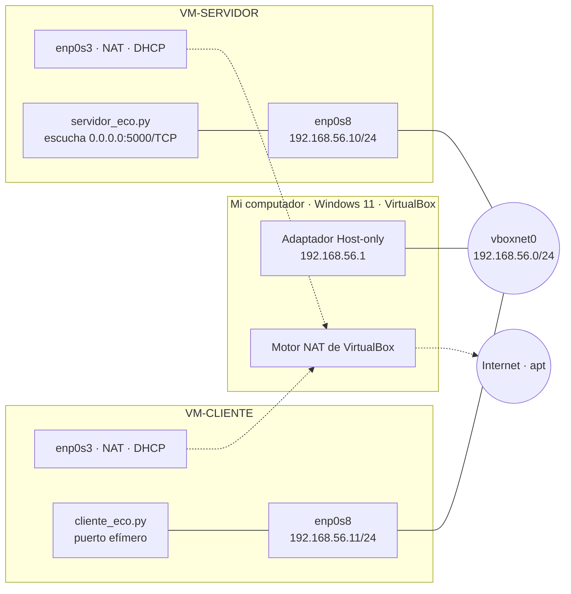
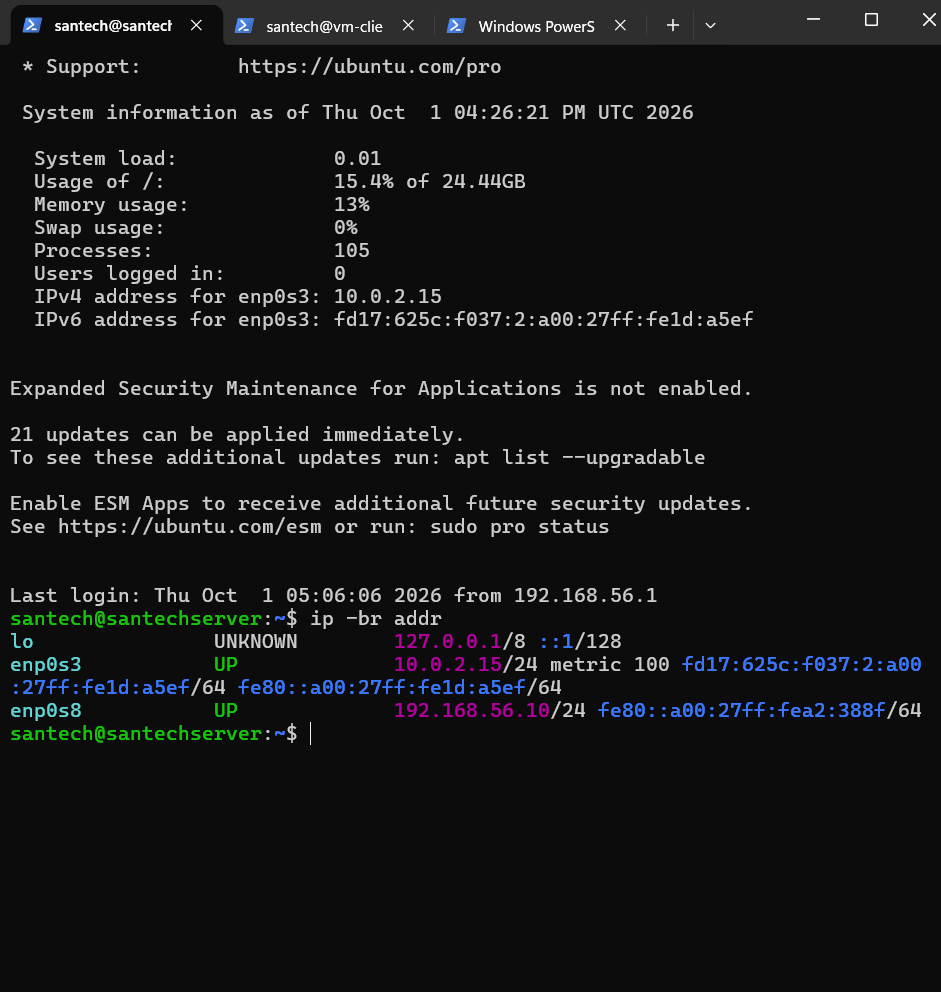
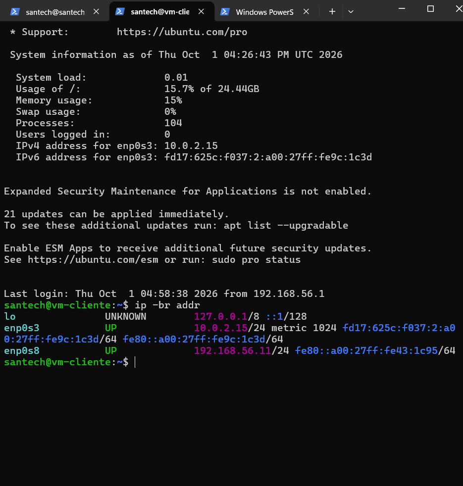
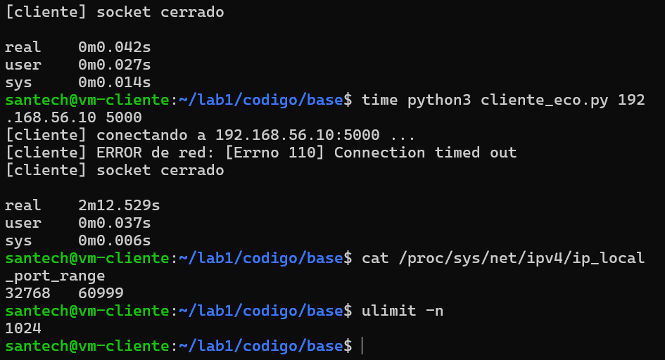

<!--
NOTAS DE TRABAJO (borrar antes de exportar a PDF)
- Límite: 15 páginas en PDF. Las capturas son lo que más ocupa: use 1-2 por experimento, recortadas.
- [PENDIENTE: ...]  = dato que solo sale de ejecutar en las VM. No se llena con suposiciones.
- [EVIDENCIA: ...]  = qué dato propio debe sostener esa respuesta. Reemplácelo por el dato y su captura.
- Los borradores son un punto de partida: reescríbalos con sus palabras (la guía pide "argumento, no definiciones copiadas").
-->

<div align="center">

**UNIVERSIDAD TECNOLÓGICA DE PEREIRA**

# Laboratorio N.º 1
## Comunicación entre procesos mediante sockets TCP

**Santiago Guevara Méndez**

Sistemas Distribuidos · Prof. Felipe Gutiérrez Isaza · 2026-2

Fecha de entrega: 6 de octubre de 2026

</div>

---

## 1. Objetivos

**General.** Implementar y observar una comunicación cliente/servidor sobre TCP entre dos máquinas virtuales, para comprobar experimentalmente qué garantiza el canal (fiabilidad y orden) y qué no garantiza (fronteras de mensaje, detección inmediata de fallos).

**Específicos** (relacionados con los resultados de aprendizaje de la guía):

1. Configurar una red privada Host-only entre dos VM y verificarla por capas: enlace, red y transporte (RA1).
2. Implementar en Python los dos extremos de una conexión TCP con la API de sockets (RA2).
3. Explicar el ciclo de vida de la conexión y qué parte ocurre en el núcleo del sistema operativo (RA3).
4. Identificar conexiones por su cuádrupla y justificar los dos sockets del servidor (RA4).
5. Demostrar que TCP entrega un flujo de bytes sin fronteras y diseñar un protocolo con delimitador (RA5, reto R2).
6. Diagnosticar fallos distinguiendo la capa de origen: red, transporte o aplicación (RA6).

## 2. Descripción del montaje

| Máquina | Rol | Interfaz NAT | Interfaz del laboratorio | Programa |
|---|---|---|---|---|
| VM-SERVIDOR | servidor | enp0s3 (DHCP) | enp0s8 · 192.168.56.10/24 | `servidor_eco.py`, puerto 5000/TCP |
| VM-CLIENTE | cliente | enp0s3 (DHCP) | enp0s8 · 192.168.56.11/24 | `cliente_eco.py`, puerto efímero |

Sistema operativo de las VM: Ubuntu 26.04.1 LTS (kernel 7.0.0-34-generic, x86_64). Python: 3.14.4 (salida de `python3 --version` en VM-SERVIDOR). Evidencia de la instalación y la configuración de red en `capturas/vm_configuracion/`.
VM-CLIENTE es un clon completo de VM-SERVIDOR, con las MAC reinicializadas y el nombre de host cambiado.



La configuración de netplan está en `red/99-laboratorio-servidor.yaml` y `red/99-laboratorio-cliente.yaml`.
El procedimiento está en `red/DESPLIEGUE.md`.

**Verificación por capas (Parte A.4):**

| Paso | Capa | Comando | Resultado obtenido |
|---|---|---|---|
| 1 | Enlace/Red | `ip -br addr` (ambas VM) | `enp0s8` en estado `UP` con `192.168.56.10/24` en VM-SERVIDOR y `192.168.56.11/24` en VM-CLIENTE. `enp0s3` (NAT) con `10.0.2.15/24` en ambas. Capturas: `A_ip_servidor.png`, `A_ip_cliente.png` |
| 2 | Red | `ping -c 4 192.168.56.10` | 4 transmitidos, 4 recibidos, 0 % de pérdida; rtt mín/media/máx = 0.354 / 0.556 / 0.752 ms, ttl=64. Captura: `A_ping.png` |
| 3 | Transporte | `nc -vz 192.168.56.10 5000` sin servidor | `nc: connect to 192.168.56.10 port 5000 (tcp) failed: Connection refused`. Captura: `A_nc_refused.png` |
| 4 | Transporte | `nc -vz 192.168.56.10 5000` con servidor | `Connection to 192.168.56.10 5000 port [tcp/*] succeeded!`. Captura: `A_nc_ok.png` |
| 5 | Transporte | `ss -ltnp` en VM-SERVIDOR | `LISTEN 0 1 0.0.0.0:5000 users:(("python3",pid=2408,fd=3))`. Send-Q = 1 corresponde al `listen(1)` del servidor. También aparecen SSH (22) y el resolvedor local (53). Captura: `A_ss_ltnp.png` |

Evidencias de la Parte A (carpeta `capturas/parteA_verificacion_capas/`):





Eco de ida y vuelta (capas de aplicación): el cliente envía `Hola` y `ingeniero` y recibe `HOLA` e `INGENIERO`. Capturas por separado, `A_eco_cliente.png` y `A_eco_servidor.png`; no hay una captura única lado a lado `A_eco_lado_a_lado.png`.


**Cuádrupla de la primera conexión:** (192.168.56.11 , 45036 , 192.168.56.10 , 5000). Se toma de lo que imprimen `cliente_eco.py` y `servidor_eco.py`.

## 3. Desarrollo por experimento

Para cada experimento se registró la predicción **antes** de ejecutarlo. Los comandos exactos están en `experimentos/GUIA_E1_E6.md`.

### 3.1 Tabla resumen: predicción / observación / explicación

| Exp. | Predicción (antes de ejecutar) | Observado | Explicación |
|---|---|---|---|
| E1 | mi prediccion va ser que va entrar en una fila de espera como un stack o una pila. C2 y C3 quedan esperando sin error y reciben su eco solo después de que se escriba `salir` en el cliente que está siendo atendido. | C2 y C3 no dieron error: `connect()` terminó y `ss` mostró 3 filas ESTAB, pero sin eco. La fila LISTEN mostró Recv-Q = 2 y Send-Q = 1. Al escribir `salir` en C1, el servidor atendió primero a C2 (puerto 52990) y luego a C3 (52992): orden de llegada, es decir una cola FIFO y no una pila. | Las tres conexiones comparten IP y puerto del servidor (192.168.56.10:5000) y la IP del cliente. Solo cambia el puerto efímero, y eso basta para que la cuádrupla sea única. El kernel completa el saludo de tres vías y deja las conexiones en la cola de `accept()` mientras la aplicación atiende a C1. [EVIDENCIA: tres cuádruplas de `ss`] |
| E2 | Que el socket de la conexión tendría un puerto distinto al 5000 del servidor (confundí socket con puerto). | S1 imprimió socket de escucha `('0.0.0.0', 5000)` y extremo local `('192.168.56.10', 5000)`, extremo remoto `('192.168.56.11', 49114)`. `ss -tan` mostró `LISTEN 0.0.0.0:5000` y `ESTAB 192.168.56.10:5000 ↔ 192.168.56.11:49114`. El puerto del servidor no cambió. | El socket de escucha está ligado a 0.0.0.0 (cualquier interfaz). El socket devuelto por `accept()` pertenece a una conexión concreta, que entró por una interfaz concreta, así que su dirección local es 192.168.56.10. [EVIDENCIA: salida del servidor y `ss -tan`] |
| E3 | Con cierre ordenado (`salir`), el servidor imprimiría una salida tipo "exit" o un error. Sin el `break`, esperaba un error. Con un cierre brusco, esperaba que el servidor quedara en un bucle y que al final se colgara. | Cierre ordenado (`salir` o Ctrl+C): S1 imprime `recv() devolvio 0 bytes` y sigue vivo, sin error. Sin el `break`: bucle infinito de `recibidos 0 bytes: b''`, `python3` al 58.4 % de CPU y 0 % de CPU inactiva. Apagado brusco: S1 no imprime nada, la conexión sigue en ESTAB más de 5 min 20 s y el servidor queda bloqueado en `recv()`. | `recv()` devuelve `b""` solo cuando llega el FIN del otro extremo. Si no hay datos todavía, `recv()` no retorna: bloquea. Sin el `break`, el bucle recibe `b""` una y otra vez sin bloquear. [EVIDENCIA: salida de `servidor_e3.py` y %CPU en `top`] |
| E4 | Que `recv()` en el servidor entregaría los mensajes de la ráfaga una sola vez. | No: en 11 conexiones salieron tres patrones distintos (3+3+4, 3+7 y 6+4) con el mismo código; con pausa 0.5 el servidor recibió 3+3+4 pero el cliente recibió los 10 bytes juntos (`UNODOSTRES`). En 3 de 11 conexiones el servidor cayó con `ConnectionResetError`. | TCP entrega los bytes completos y en orden, pero no conserva los límites de cada `sendall()`. La agrupación depende del momento en que llegan los segmentos y de cuándo se llama a `recv()`. [EVIDENCIA: tabla de corridas de E4] |
| E5 | No registré una predicción antes de ejecutar este experimento. (Opinión dada después de ver el resultado, por eso no cuenta como predicción: creía que, al reiniciar el servidor enseguida, no habría espera por TIME_WAIT.) | Sin `SO_REUSEADDR`: `OSError: [Errno 98] Address already in use` en `bind()`; el puerto tardó unos 60 s en liberarse (`timewait,56sec` a las 19:27:31, `bind()` posible a las 19:28:31). Con `SO_REUSEADDR`: el servidor reinició de inmediato aun con un TIME_WAIT activo (`timewait,55sec`). | Quien cierra primero queda en TIME_WAIT (2·MSL). Mientras tanto, sin SO_REUSEADDR, el kernel rechaza un nuevo `bind()` a ese puerto. [EVIDENCIA: excepción y temporizador de `ss -tano`] |
| E6 | Que todos los fallos ocurrirían al instante, y que el error sería distinto en cada caso. | F1, F2 y F4: `conexion rechazada` en 0.04 s. F3: `No route to host` en 3.152 s (ARP sin respuesta, `ip neigh` en `FAILED`). F5: `Connection timed out` en 2 min 12.5 s. Solo F1, F2 y F4 fueron instantáneos, y esos tres dieron el mismo error. | Un fallo rápido significa que el destino respondió algo (un RST): se llegó a la máquina. Un fallo lento significa que no respondió nada (temporizador). El diagnóstico sube por capas: `ip`, `ping`, `nc`/`ss` y luego la aplicación. [EVIDENCIA: tabla F1–F5 con tiempos] |

### 3.2 E1: la conexión tiene cuatro identificadores

Capturas (carpeta `capturas/E1_cuadrupla/`). La primera muestra a la vez las cuatro pestañas: S1, S2 (`ss`), C2 y C3, con C1 ya conectado y atendido. La segunda muestra el orden en que S1 atendió a C2 y luego a C3.


La captura `E1_ss_servidor.png` es la misma imagen que `E1_tres_clientes.png` (el `ss` está en la pestaña S2).

Salida de `ss` en VM-SERVIDOR con C1, C2 y C3 conectados (S1 atendía a C1):

```
$ ss -tn state established '( sport = :5000 )'
Recv-Q  Send-Q  Local Address:Port    Peer Address:Port
0       0       192.168.56.10:5000    192.168.56.11:58596
0       0       192.168.56.10:5000    192.168.56.11:52992
0       0       192.168.56.10:5000    192.168.56.11:52990

$ ss -ltn '( sport = :5000 )'
State   Recv-Q  Send-Q  Local Address:Port    Peer Address:Port
LISTEN  2       1       0.0.0.0:5000          0.0.0.0:*
```

| Conexión | IP origen | Puerto origen | IP destino | Puerto destino |
|---|---|---|---|---|
| C1 | 192.168.56.11 | 58596 | 192.168.56.10 | 5000 |
| C2 | 192.168.56.11 | 52990 | 192.168.56.10 | 5000 |
| C3 | 192.168.56.11 | 52992 | 192.168.56.10 | 5000 |

Las tres conexiones estaban en ESTAB, pero solo C1 fue atendida por `accept()`. C2 y C3 esperaron en la cola del kernel (Recv-Q = 2 en la fila LISTEN).

- **E1.1** Lo idéntico en las tres conexiones es la IP y el puerto del servidor, y también la IP del cliente, porque las tres salen de VM-CLIENTE. Solo cambia el puerto efímero. [EVIDENCIA: columnas de la tabla]
- **E1.2** Cuando llega un segmento, el kernel busca la conexión por la cuádrupla completa. Cada puerto efímero identifica un socket de datos distinto, con sus propios búferes, y la respuesta sale por ese socket hacia ese puerto.
- **E1.3** Desde un mismo cliente, hacia la misma IP y puerto del servidor, la cuádrupla solo puede variar en el puerto de origen. El límite teórico es el rango de puertos efímeros del cliente. En la práctica suelen agotarse antes los descriptores de archivo o la memoria. Medido en VM-CLIENTE: `cat /proc/sys/net/ipv4/ip_local_port_range` dio `32768 60999`, es decir, 28 232 puertos efímeros disponibles; `ulimit -n` dio `1024` descriptores de archivo por proceso. Como cada conexión usa un descriptor, y además están ocupados stdin, stdout y stderr, un solo proceso agota los descriptores (unos 1 020 sockets) mucho antes que los puertos. [EVIDENCIA: `capturas/E1_cuadrupla/E1_limites_cliente.png`]


- **E1.4** C2 y C3 no recibieron ningún error: `connect()` terminó con éxito y los mensajes `hola2` y `hola3` se enviaron, pero no hubo eco mientras C1 seguía conectado. C2 recibió `HOLA2` apenas se cerró C1, y C3 recibió `HOLA3` al cerrarse C2. Argumento: `listen(1)` fija el tamaño de la cola de conexiones ya establecidas que esperan `accept()`. No limita cuántos clientes se atienden. El saludo de tres vías lo completa el kernel aunque la aplicación siga ocupada con C1, y los datos que el cliente envía quedan guardados en el búfer del socket hasta que el servidor llame a `accept()` y `recv()`. [EVIDENCIA: Recv-Q = 2 y Send-Q = 1 en la fila LISTEN; S1 imprimió `cliente remoto : 192.168.56.11:52990` y después `...:52992`]
- **Predicción vs. resultado.** Acerté en que C2 y C3 quedarían en espera y recibirían su eco solo después de cerrar el cliente atendido. Fallé en la estructura: la cola de `accept()` atiende por orden de llegada (FIFO), no como pila (LIFO). Si hubiera sido una pila, C3 habría sido atendido antes que C2. Un detalle: el servidor es iterativo, atiende un cliente a la vez, y por eso C3 esperó también a que C2 escribiera `salir`.
- **Nota sobre Recv-Q = 2 con `listen(1)`.** El backlog es 1 y la cola contuvo 2 conexiones. En Linux la cola de conexiones establecidas admite `backlog + 1`, por eso aceptó hasta dos esperando. Se probó con un cuarto cliente (`capturas/E1_cuadrupla/E1_ss_cliente_cuarto_cliente.png`). Predicción mía antes de probar: C4 se conecta y también queda en cola. **No fue así.**


Con C1 atendido y C2 y C3 en la cola, `ss -tn '( dport = :5000 )'` en VM-CLIENTE mostró:

```
State     Recv-Q  Send-Q  Local Address:Port    Peer Address:Port
ESTAB     0       0       192.168.56.11:51852   192.168.56.10:5000    (C2)
ESTAB     0       0       192.168.56.11:36298   192.168.56.10:5000    (C1)
ESTAB     0       0       192.168.56.11:36876   192.168.56.10:5000    (C3)
SYN-SENT  0       1       192.168.56.11:54312   192.168.56.10:5000    (C4)
```

En VM-SERVIDOR, `ss -ltn '( sport = :5000 )'` siguió mostrando `LISTEN Recv-Q 2, Send-Q 1`. C4 no pasó de `SYN-SENT`: nunca llegó a `conectado`, y terminó con `[Errno 110] Connection timed out` tras **2 min 15.487 s**. Es decir, la cola de conexiones establecidas ya estaba llena (backlog 1 admite 2 en Linux), y el servidor descartó el SYN de C4 sin responder, de modo que el cliente solo reintentó hasta rendirse. El error es el mismo y el tiempo parecido al de F5 (cortafuegos): para el cliente, una cola llena y un filtro son indistinguibles. Que el límite sea `backlog + 1` queda así confirmado en la práctica, aunque el comportamiento exacto del descarte no lo verifiqué con `tcpdump`.

### 3.3 E2: el servidor maneja dos sockets distintos

Captura (`capturas/E2_sockets/E2_ss_y_servidor.png`): S1 con las líneas impresas, S2 con el `ss -tan`, y los clientes.


Salida de S1 con un cliente conectado:

```
[servidor] cliente remoto : 192.168.56.11:49114
[servidor] extremo local  : ('192.168.56.10', 5000)
[servidor] extremo remoto : ('192.168.56.11', 49114)
[servidor] socket de escucha sigue siendo: ('0.0.0.0', 5000) (distinto objeto)
```

Salida de `ss -tan '( sport = :5000 )'` en VM-SERVIDOR:

```
State      Recv-Q  Send-Q  Local Address:Port    Peer Address:Port
LISTEN     0       1       0.0.0.0:5000          0.0.0.0:*
TIME-WAIT  0       0       192.168.56.10:5000    192.168.56.11:52992
ESTAB      0       0       192.168.56.10:5000    192.168.56.11:49114
```

| Socket | Dirección local | Puerto local | Extremo remoto |
|---|---|---|---|
| Escucha (LISTEN) | 0.0.0.0 | 5000 | 0.0.0.0:* |
| Conexión (ESTAB) | 192.168.56.10 | 5000 | 192.168.56.11:49114 |

**Predicción vs. resultado.** Predije que el socket de la conexión tendría un puerto distinto al 5000. No fue así: ambos sockets usan el puerto 5000. Un socket no es un puerto; es el objeto que representa un extremo de comunicación, y lo identifica la combinación de dirección y puerto. Lo que difiere es la dirección local (`0.0.0.0` contra `192.168.56.10`) y que el socket de la conexión tiene un extremo remoto. El puerto distinto es el del cliente (49114).

**Observación extra.** La fila `TIME-WAIT` con `…:52992` es la conexión anterior de C3 en E1, ya cerrada. Se retoma en E5. [PENDIENTE: confirmar en E5 qué extremo cerró primero]

- **E2.1** El socket de escucha se ligó con `bind(("0.0.0.0", 5000))`: acepta por cualquier interfaz y no tiene una IP local concreta. El socket de la conexión sí la tiene, la IP por la que entró el SYN (192.168.56.10), porque ya forma parte de una cuádrupla concreta. [EVIDENCIA: líneas "socket de escucha" y "extremo local"]
- **E2.2** Un socket en estado LISTEN no tiene flujo de datos asociado. En Linux, `recv()` sobre él falla con `OSError` (ENOTCONN, "Transport endpoint is not connected"). [EVIDENCIA opcional: probarlo en el intérprete de python3 de la VM]
- **E2.3** La observación coincide con la cita: el socket de escucha nunca aparece en los `recv()` y `sendall()` del código. Su único trabajo es "producir" el socket de la conexión en cada `accept()`.

### 3.4 E3: qué significa que recv() devuelva cero

Captura de E3.1/E3.2 (`capturas/E3_recv_cero/E3_cierre_ordenado.png`):


Captura de E3.3 (`capturas/E3_recv_cero/E3_sin_break_salida_y_top.png`): arriba `top` en S2, abajo a la izquierda la salida de S1 y a la derecha los clientes. Una sola imagen cubre `E3_sin_break_salida.png` y `E3_sin_break_top.png`.


Captura de E3.4 (`capturas/E3_recv_cero/E3_apagado_brusco.png`): S2 con las dos mediciones de `ss -tno` con hora, S1 sin mensajes nuevos y C1 con el cliente nuevo esperando.


- **E3.1** En los dos cierres, con `salir` y con Ctrl+C, S1 imprimió exactamente lo mismo: `[servidor] recv() devolvio 0 bytes -> el cliente cerro la conexion`, seguido de `[servidor] conexion cerrada. Vuelvo a accept()`. El servidor no mostró error ni se cayó, y siguió esperando conexiones. Con `salir` el cliente imprimió `socket cerrado`; con Ctrl+C imprimió `interrumpido por el usuario` y luego `socket cerrado`. Para el servidor no hay diferencia: en ambos casos el cliente cierra el socket y el kernel envía un FIN.
- **Predicción vs. resultado (E3.1/E3.2).** Predije que el servidor imprimiría un "exit" o un error. Lo que apareció no es un error: es el aviso normal de que `recv()` devolvió 0 bytes (fin ordenado de la conexión), y el servidor sigue vivo. Sigue pendiente comparar la predicción de E3.3 y E3.4.
- **E3.2** "No hay datos" hace que `recv()` bloquee: el proceso duerme hasta que llegue algo. "0 bytes" es un retorno inmediato que significa que el otro extremo envió FIN y no habrá más datos. El programa los distingue porque en el primer caso `recv()` ni siquiera retorna.
- **E3.3** Después de que el cliente escribió `salir`, S1 empezó a imprimir sin parar y a gran velocidad el par `[servidor] recibidos 0 bytes: b''` / `[servidor] enviados 0 bytes: b''`. En `top` (S2), el proceso `python3` del servidor (PID 3404) estaba en estado `R` (ejecutándose) con **58.4 % de CPU**. La línea global de CPU marcó `24.2 us, 56.6 sy, 19.2 si, 0.0 id`: 0 % de CPU inactiva. Otro proceso de usuario (PID 1414, 31.7 % de CPU) acompañaba al servidor; es probablemente la sesión SSH que transporta toda esa salida a la terminal, aunque no lo verifiqué con `ps`. Predicción vs. resultado: predije un error o un bucle que se cuelga. No hubo error ni excepción: el bucle simplemente no termina, y no se "cuelga" en el sentido de quedar bloqueado, sino al revés: no bloquea y consume CPU. Explicación: después del FIN, cada `recv()` retorna `b""` al instante, sin bloquear. El bucle nunca sale y consume CPU (busy loop).
- **E3.4** Se apagó VM-CLIENTE desde VirtualBox (Apagar la máquina, sin cerrar el sistema) con una conexión abierta, cliente `192.168.56.11:59966`. El apagado fue hacia la 1:50 p. m. mi hora local (UTC-5), es decir, hacia las **18:50 UTC**, que es la hora que usan las VM. El servidor **no se enteró**: S1 no imprimió nada después de `enviados 4 bytes: b'HOLA'`. `ss -tno '( sport = :5000 )'` en VM-SERVIDOR mostró la conexión en **ESTAB** a las 18:57:23 y seguía en **ESTAB** a las 19:02:43, es decir, unos 7 minutos y unos 12 minutos después del apagado (18:50 UTC aproximadas), sin ningún temporizador en la fila (`-o` no mostró `timer:`, porque no hay keepalive activo ni datos sin confirmar). Al encender VM-CLIENTE y lanzar un cliente nuevo (puerto efímero 44296), este se conectó (`conectado`) pero **no recibió eco** de `hola`. El `ss` de las 19:02:43 mostró la conexión nueva `44296` con **Recv-Q = 4**: los 4 bytes de `hola` estaban en el búfer del kernel sin que ninguna aplicación los leyera, y la vieja `59966` seguía en ESTAB. Predicción vs. resultado: predije que el servidor quedaría en un bucle y "se colgaría". Se colgó, pero no por un bucle: el servidor, que es iterativo, quedó **bloqueado en `recv()`** esperando datos de un cliente que ya no existe, y por eso no atiende a nadie más. Argumento: el FIN o el RST los envía el kernel del cliente, y una VM apagada de golpe no alcanza a enviarlos. El servidor, bloqueado en `recv()` y sin nada que enviar, no genera tráfico que pueda revelar la caída. Sin keepalive, la conexión puede quedar en ESTABLISHED indefinidamente (conexión "medio abierta").

### 3.5 E4: TCP es un flujo de bytes

| Corrida | Pausa | recv() del servidor (bytes de cada uno) | recv() del cliente |
|---|---|---|---|
| 1 | 0 | 3 `uno` + 7 `dostres` (puerto 60610), cierre ordenado | `UNO` (3 bytes) |
| 2 | 0.5 | 3 `uno` + 3 `dos` + 4 `tres` (puerto 48248), cierre ordenado | `UNODOSTRES` (10 bytes) |
| 3 (bucle 1) | 0 | 6 `unodos` + 4 `tres` (puerto 42898), cierre ordenado | `UNODOS` (6 bytes) |
| 4 (bucle 2) | 0 | 3 `uno` + 7 `dostres` (puerto 42900), cierre ordenado | `UNO` (3 bytes) |
| 5 (bucle 3) | 0 | 6 `unodos` + 4 `tres` (puerto 41344), cierre ordenado | `UNODOS` (6 bytes) |
| 6 (bucle 4) | 0 | 3 `uno` + 7 `dostres` (puerto 41348), **servidor cae con `ConnectionResetError`** | `UNO` (3 bytes) |
| 7 (bucle 5) | 0 | el servidor ya no existía (había caído en la anterior) | `ERROR de red: [Errno 111] Connection refused` |

Resumen de lo que imprimió S1 en las 11 conexiones obtenidas (archivo `capturas/E4_flujo_bytes/E4_servidor_resumen.txt`). Cada número es lo que devolvió un `recv()` del servidor:

| Patrón de `recv()` en el servidor | Veces | Conexiones (puerto efímero) |
|---|---|---|
| 3 + 3 + 4 (`uno`, `dos`, `tres`) | 3 | 50134, 47652, 37202 |
| 3 + 7 (`uno`, `dostres`) | 6 | 37200, 37208, 42866, 42890, 42900, 41348 |
| 6 + 4 (`unodos`, `tres`) | 2 | 42898, 41344 |

En las 11 conexiones la suma fue 10 bytes. El cliente envía `uno`, `dos` y `tres` en tres llamadas separadas, y el servidor los recibió de tres formas distintas con el mismo código y el mismo cliente. En 3 de las 11 conexiones (37208, 42866 y 41348) el servidor se cayó con `ConnectionResetError: [Errno 104] Connection reset by peer`.

Predicción vs. resultado: predije que `recv()` entregaría los mensajes una sola vez. No fue así: la agrupación varió entre corridas (tres patrones distintos). Las corridas 1 y 2 se repitieron una por una, con captura (`capturas/E4_flujo_bytes/`):


- **Corrida 1 (pausa 0):** el servidor recibió `uno` y luego `dostres` juntos (2 `recv()`: 3 + 7 bytes). El cliente leyó solo `UNO`.
- **Corrida 2 (pausa 0.5):** el servidor recibió los tres mensajes **separados** (3 + 3 + 4). Aun así, el único `recv()` del cliente devolvió `UNODOSTRES` (10 bytes) **juntos**: los tres ecos ya estaban acumulados en su búfer cuando llamó a `recv()`, después de 1 s de pausas. Es decir, que lleguen separados al servidor no garantiza que el cliente los reciba separados.
- **Predicción vs. resultado (pausa 0.5).** Mi predicción fue que llegarían separados. Se cumplió en el servidor (3 + 3 + 4). No se cumplió en el cliente, donde llegaron juntos.

Notas de las demás conexiones del bucle en las corridas 3 a 7: ver la tabla.

Segunda ejecución del bucle de cinco corridas (`capturas/E4_flujo_bytes/E4_cinco_corridas.png`; en la captura se alcanza a ver desde la corrida 2, la 1 quedó arriba fuera de pantalla):


- **Corrida 2:** el servidor recibió los tres mensajes separados (`uno`, `dos`, `tres`: 3 + 3 + 4) y el cliente leyó solo `UNO`. Después el servidor cayó con una excepción **distinta** a las anteriores: `BrokenPipeError: [Errno 32] Broken pipe` en `conexion.sendall(respuesta)` (línea 73 de `servidor_eco.py`), no `ConnectionResetError` al hacer `recv()`. Es decir, el servidor intentó escribir un eco en un socket que el cliente ya había cerrado (el cliente hace un solo `recv()` y se va). Lo que determina cuál de las dos excepciones sale (`ECONNRESET` al leer o `EPIPE` al escribir) es el momento en que el RST llega respecto a las operaciones del servidor. [PENDIENTE: confirmarlo con `tcpdump`; la explicación es mi hipótesis.]
- **Corridas 3, 4 y 5:** `[Errno 111] Connection refused`, porque el servidor había caído y nadie escuchaba en el 5000.

El hallazgo importante es que `servidor_eco.py` no captura errores de red: cualquier cliente que se comporte mal (cierre brusco con datos sin leer) puede tirar el servidor completo, y entonces fallan todos los demás clientes.

Las cinco corridas del primer bucle (corridas 3 a 7 de la tabla) sí quedaron emparejadas por puerto efímero entre la salida del cliente y la de S1. Resultado: los clientes recibieron `UNODOS`, `UNO`, `UNODOS`, `UNO` y en la quinta corrida `Connection refused`, porque el servidor había caído al final de la corrida anterior. Es decir, el mismo comando, ejecutado cinco veces seguidas, dio cinco resultados distintos. Además, el cliente solo hace **un** `recv()` y por eso nunca lee los ecos completos (10 bytes): en cada corrida le quedan bytes del eco sin leer.

- **E4.1** No se pierde ni se desordena ningún byte: la suma de bytes y su orden coinciden. Lo que no se conserva es la **frontera** entre un `sendall()` y el siguiente. [EVIDENCIA: suma de bytes por corrida = 10]
- **E4.2** En el búfer de recepción del socket del cliente, dentro del kernel. Los segmentos llegaron, se confirmaron con ACK y quedaron en cola hasta que la aplicación llamó a `recv()`.
- **E4.3** No fueron iguales: con el mismo código y el mismo cliente aparecieron tres patrones distintos (3+3+4, 3+7 y 6+4), y en 3 de las 11 conexiones el servidor se cayó con `ConnectionResetError` (RST). [PENDIENTE: confirmar la causa del RST con `tcpdump` o con la salida del cliente; mi hipótesis es que el cliente cierra con `dostres` todavía sin leer y el kernel responde con RST, pero no está verificada]. La implicación es que los errores dependen de la temporización (carga, planificador, latencia): el mismo código puede pasar una prueba y fallar la siguiente. Por eso no basta con "a mí me funcionó una vez".
- **E4.4** "fiable, en orden" explica que lleguen los 10 bytes en su orden. "flujo de bytes" es justamente lo que nunca prometió conservar mensajes: el flujo no tiene fronteras.
- **E4.5** La documentación de Python enumera cuatro estrategias: longitud fija, delimitador, prefijo de longitud y cerrar la conexión al final. Para transferencias bancarias conviene el **prefijo de longitud**: permite cualquier contenido, sin escapar caracteres, y el receptor sabe de antemano cuánto leer y puede rechazar tamaños absurdos. En R2 se usó delimitador porque el contenido es texto de una línea. [EVIDENCIA: R2 funcionando]
- **E4.6** A la estrategia de **indicar la longitud** (prefijo de longitud) en la cabecera.

### 3.6 E5: TIME_WAIT y SO_REUSEADDR

Captura de E5 sin `SO_REUSEADDR` (`capturas/E5_time_wait/E5_sin_reuseaddr.png`): arriba S2 con el `ss -tano state time-wait`, abajo a la izquierda S1 con el error de `bind()` y la medición, y a la derecha C1.


Repetición con `servidor_eco.py` (con `SO_REUSEADDR`) (`capturas/E5_time_wait/E5_con_reuseaddr.png`): el servidor se cerró primero y el cliente después, igual que antes. A las 19:31:54, `ss -tano state time-wait` mostró `TIME-WAIT 192.168.56.10:5000 ↔ 192.168.56.11:38688` con `timer:(timewait,55sec,0)`, y aun así el servidor se reinició de inmediato sin error: `[servidor] socket de escucha en ('0.0.0.0', 5000)` y `esperando conexiones...`.


Conclusión: la única diferencia entre las dos pruebas es esa línea. Sin `SO_REUSEADDR`, `bind()` falla con `Errno 98` mientras haya un TIME_WAIT en el puerto; con ella, el servidor arranca aunque la conexión anterior siga en TIME_WAIT.

- **E5.1** Con `servidor_e5.py` (sin `SO_REUSEADDR`), al reiniciar el servidor justo después de cerrarlo con Ctrl+C: `OSError: [Errno 98] Address already in use`, en la línea `servidor.bind((HOST, PUERTO))` (línea 33 de `servidor_e5.py`, dentro de `main`).
- **E5.2** Orden de los hechos: el servidor se cerró primero (Ctrl+C en S1) y después el cliente (Ctrl+C en C1). A las 19:27:15, `ss -tano state time-wait` no mostró nada; a las 19:27:31 apareció `TIME-WAIT 192.168.56.10:5000 ↔ 192.168.56.11:49094` con `timer:(timewait,56sec,0)`. La conexión quedó en TIME_WAIT en el lado del **servidor**, que cerró primero. Medición del paso 8: el bucle que prueba `bind()` empezó a las **19:28:07** y terminó a las **19:28:31**, es decir, el puerto estuvo ocupado 24 s más después de ese punto. Con el temporizador visto (56 s restantes a las 19:27:31), el puerto debía liberarse hacia las 19:28:27; la medición dio 19:28:31, una diferencia de unos 4 s. [PENDIENTE: explicar o descartar esa diferencia de 4 s; podría ser la granularidad del bucle y el arranque de Python, no lo verifiqué]. La duración total de TIME_WAIT coincide con 60 s. No se registró predicción de E5 antes de ejecutarlo. La idea expresada después (que reiniciar rápido no daría espera por TIME_WAIT) no se cumplió sin `SO_REUSEADDR`: el reinicio inmediato falló con `Errno 98`. Contraste teórico: TIME_WAIT dura 2·MSL. En Linux esa duración está fijada en el kernel (constante `TCP_TIMEWAIT_LEN`). [EVIDENCIA: compare su medición con el temporizador de `ss -tano`]
- **E5.3** Si la misma cuádrupla se reutilizara de inmediato, un segmento retrasado de la conexión anterior podría entrar en la nueva como si fuera válido. TIME_WAIT también permite retransmitir el último ACK si el FIN del otro extremo se repite.
- **E5.4** El riesgo es aceptar esos segmentos rezagados, algo poco probable porque los números de secuencia también tendrían que caer en la ventana. Se acepta porque un servidor que se reinicia no puede quedar fuera de servicio el tiempo de TIME_WAIT. Además, el socket de escucha nuevo no reutiliza ninguna cuádrupla vieja: cada cliente nuevo llega con otro puerto efímero.

### 3.7 E6: diagnóstico por capas

| # | Fallo | Error exacto | Tiempo | ¿Qué respondió el destino? | Capa |
|---|---|---|---|---|---|
| F1 | Servidor detenido | `ConnectionRefusedError`, que `cliente_eco.py` imprime como `[cliente] ERROR: conexion rechazada. Nadie escucha en 192.168.56.10:5000` | 0.046 s (`real`) | Rechazo inmediato de la conexión (el kernel del servidor respondió; el cliente lo reporta como `rechazada`). Verificación en VM-SERVIDOR: `ss -ltnp` sin ninguna línea con `:5000`. [PENDIENTE: confirmar que fue un RST con `tcpdump`] | Transporte/aplicación |
| F2 | Puerto 5001 | `ConnectionRefusedError`, mostrado como `[cliente] ERROR: conexion rechazada. Nadie escucha en 192.168.56.10:5001` | 0.041 s (`real`) | Rechazo inmediato (la IP respondió, pero ese puerto no tiene a nadie). Verificación en VM-SERVIDOR: `ss -ltnp` mostró `LISTEN 0.0.0.0:5000` con `python3` (pid 3794) y ninguna línea con `:5001`. [PENDIENTE: confirmar RST con `tcpdump`] | Transporte/aplicación |
| F3 | IP 192.168.56.99 | `[cliente] ERROR de red: [Errno 113] No route to host` (`EHOSTUNREACH`) | **3.152 s** (`real`) | Nadie respondió. `ip neigh show 192.168.56.99` mostró `192.168.56.99 dev enp0s8 FAILED`: la resolución ARP de esa IP fracasó. | Red (enlace/red) |
| F4 | HOST = 127.0.0.1 | `[cliente] ERROR: conexion rechazada. Nadie escucha en 192.168.56.10:5000` (`ConnectionRefusedError`) | 0.042 s (`real`) | Rechazo inmediato, idéntico a F1. Verificación en VM-SERVIDOR: `ss -ltnp` mostró `LISTEN 127.0.0.1:5000` con `python3` (pid 3860) y `nc -vz 127.0.0.1 5000` dio `succeeded!` (S1 registró una conexión desde `127.0.0.1:37060`). | Aplicación (configuración) |
| F5 | ufw activo | `[cliente] ERROR de red: [Errno 110] Connection timed out` | **2 min 12.529 s** (`real`) | Ninguna respuesta: el cortafuegos descartó el SYN sin contestar. Verificación en VM-SERVIDOR: `ss -ltnp` mostró `LISTEN 0.0.0.0:5000` con `python3` (pid 3891), es decir, el servidor sí estaba escuchando. `sudo ufw status verbose` con el cortafuegos activo (repetición de F5, `capturas/E6_fallos_por_capas/E6_F5_ufw_status.png`) mostró `Status: active`, `Default: deny (incoming), allow (outgoing)` y como única regla `22/tcp ALLOW IN Anywhere` (y su versión v6): ninguna regla permite el 5000, así que el SYN se descarta | Red/transporte (filtrado) |

Evidencia de F1 (`capturas/E6_fallos_por_capas/`): el cliente falló al instante y en el servidor `ss -ltnp` solo mostraba SSH (22) y el resolvedor local (53), nadie en el 5000.


Predicción vs. resultado (F1): predije que fallaría al instante, y fue así (0.046 s).

Evidencia de F2 (`capturas/E6_fallos_por_capas/E6_F2.png`): arriba `ss -ltnp` en S2 con el servidor escuchando solo en el 5000, y abajo a la derecha el cliente rechazado al intentar el 5001 en 0.041 s.


Evidencia de F3 (`capturas/E6_fallos_por_capas/E6_F3.png`): abajo a la derecha el cliente con `No route to host` y `real 0m3.152s`; arriba a la derecha el `ip neigh` con `FAILED`.


Evidencia de F4 (`capturas/E6_fallos_por_capas/E6_F4.png`): el `diff` muestra que solo cambió la línea `HOST`; el `ss -ltnp` de S2 muestra `127.0.0.1:5000`; el `nc` local funciona y el cliente remoto es rechazado en 0.042 s.


Evidencia de F5 (`capturas/E6_fallos_por_capas/E6_F5.png`): abajo a la derecha el cliente con `Connection timed out` y `real 2m12.529s`; arriba a la izquierda `ss -ltnp` con el servidor escuchando en `0.0.0.0:5000` y, debajo, `sudo ufw disable` para dejar la VM como estaba.


Repetición de F5 (`capturas/E6_fallos_por_capas/E6_F5_repeticion.png`): el cliente volvió a terminar con `[Errno 110] Connection timed out`, esta vez en **2 min 12.752 s**, casi igual que en la primera medición (2 min 12.529 s). El tiempo es estable porque lo fija el número de reintentos de SYN del kernel, no la carga.


Predicción vs. resultado (F5): predije que fallaría al instante. No fue así: tardó **2 min 12 s**, el caso más lento de todos. El error fue `ETIMEDOUT` (`Errno 110`), distinto a los de F1 a F4. La clave es que el cortafuegos **descarta** el SYN sin responder: el cliente reintenta el SYN con esperas crecientes hasta que el sistema se rinde. En Linux, con los valores por defecto (6 reintentos de SYN, con backoff exponencial), el tiempo total es de unos 127 s, que es compatible con los 132 s medidos, aunque no verifiqué el valor `tcp_syn_retries` en la VM. Aquí el servidor funciona y escucha en el puerto correcto, y el fallo está en el camino de red (un filtro), no en el programa.

Predicción vs. resultado (F4): predije que el servidor «revisa si la conexión es local y la rechaza o la deja pasar». El resultado coincide en lo esencial (la conexión desde otra VM fue rechazada y la local pasó), con un matiz: quien decide no es el programa sino el kernel. Un socket ligado a `127.0.0.1:5000` solo coincide con paquetes dirigidos a esa dirección. El SYN que llega por `enp0s8` a `192.168.56.10:5000` no coincide con ningún socket en escucha, así que el kernel contesta RST, igual que en F1 aunque aquí el proceso sí está vivo. Desde fuera, F1 y F4 son indistinguibles: solo `ss -ltnp` en el servidor revela la diferencia (`127.0.0.1:5000` en vez de `0.0.0.0:5000`). Detalle del código: el comentario de `servidor_f4.py` sigue diciendo «escucha en todas las interfaces de la VM» tras el `sed`, porque solo cambió el valor de `HOST`; es un comentario desactualizado, no un error de ejecución.

Predicción vs. resultado (F3): predije que fallaría al instante. No fue así: tardó **3.152 s**, unas 70 veces más que F1 y F2, y el error fue distinto (`No route to host` en vez de `conexion rechazada`). La causa está en la capa de enlace/red: el cliente no puede ni enviar el SYN, porque primero necesita la dirección MAC de 192.168.56.99 por ARP. Como nadie responde al ARP, el kernel marca la entrada `FAILED` y devuelve `EHOSTUNREACH`. Los ~3 s son compatibles con los valores por defecto de Linux para ARP (unos 3 sondeos separados por 1 s), pero no lo verifiqué en la VM. [PENDIENTE: opcional, `sudo tcpdump -i enp0s8 -nn 'arp'` en VM-CLIENTE durante F3 para ver las solicitudes ARP sin respuesta]. Esto difiere de la pista de la guía («se agota un temporizador»): aquí no es un timeout de TCP, es un fallo de ARP.

Predicción vs. resultado (F2): predije que fallaría al instante (se cumplió: 0.041 s) y que el error sería distinto en cada caso. En F1 y F2 el mensaje del cliente fue el mismo (`conexion rechazada`), porque el programa no distingue entre «no hay servidor» y «puerto equivocado»: ambos llegan como el mismo error de Python. La diferencia está en la causa, no en lo que ve el cliente: en F1 no había ningún proceso escuchando en el servidor, y en F2 el servidor sí estaba activo pero en otro puerto. Eso solo se distingue mirando `ss -ltnp` en el servidor.

- **E6.2** En F1, la máquina existe y su kernel responde al SYN con un **RST**, porque nadie escucha: el error llega al instante. En F3 no existe ningún equipo que responda. Resultado observado: no fue un timeout de TCP sino un fallo de ARP (`No route to host` tras 3.152 s, con `ip neigh` en estado `FAILED`), como se explica en la evidencia de F3.
- **E6.3** En el servidor, `ss -ltnp` (¿hay alguien en :5000?) y `sudo ufw status verbose` (¿hay una regla que filtra?). Con `tcpdump` se ve si el SYN llega y si sale un RST. [EVIDENCIA: capturas de F1 y F5]
- **E6.4** Con 127.0.0.1 el socket de escucha solo acepta conexiones que lleguen por la interfaz de loopback. Un SYN que entra por enp0s8 hacia 192.168.56.10:5000 no coincide con ningún socket en escucha, y el kernel responde RST: se comporta como F1 aunque el proceso esté vivo. [EVIDENCIA: `ss -ltnp` mostrando 127.0.0.1:5000 y `nc` local exitoso]
- **E6.5** Tabla de diagnóstico:

| Síntoma | Capa | Comando que lo confirma |
|---|---|---|
| Sin IP en enp0s8 o interfaz DOWN | Enlace/Red | `ip -br addr` |
| `ping` falla | Red | `ping`, `ip route`, `ip neigh` |
| `ping` funciona, conexión rechazada al instante | Transporte (nadie escucha en ese IP:puerto) | `ss -ltnp` en el servidor |
| `ping` funciona, conexión se cuelga hasta un timeout | Red/transporte (filtrado) | `sudo ufw status`, `tcpdump` |
| Conecta pero la respuesta es incorrecta o no llega | Aplicación | salida de los programas, `ss -tn` (Recv-Q/Send-Q) |

## 4. Retos de implementación

### 4.1 R1: registro de conexiones (`codigo/r1/servidor_r1.py`)

Cada conexión agrega una línea a `bitacora.log` con este formato:

```
<ISO 8601 inicio> cliente=<ip>:<puerto> mensajes=<n> bytes_recibidos=<n> bytes_enviados=<n> cierre=<normal|error>
```

- La IP y el puerto se obtienen con `getpeername()` sobre el socket devuelto por `accept()`, como primera acción de `atender_conexion()`.
- La línea se escribe en un `finally`, así que queda registrada también si la conexión termina con `ConnectionResetError`.
- El archivo se abre en modo *append* con UTF-8 y se cierra en cada escritura, para que el registro sobreviva a una caída posterior del servidor.
- **Conteo de bytes:** `bytes_recibidos` suma `len(datos)` de cada `recv()` no vacío. `bytes_enviados` suma `len(respuesta)` solo cuando `sendall()` retorna sin error, porque `sendall()` o entrega todo o lanza una excepción.
- **Qué es un "mensaje" aquí:** el servidor de eco no tiene protocolo de fronteras, así que la unidad que procesa y responde es lo que trae cada `recv()`. Por eso "mensaje" = un `recv()` con datos. Como mostró E4, ese número puede no coincidir con los `sendall()` del cliente.

**Prueba local en mi computador** (Windows, 127.0.0.1; salida real, archivo `capturas/anfitrion/fase2_bitacora.log`):

```
2026-09-30T13:59:24-05:00 cliente=127.0.0.1:49840 mensajes=2 bytes_recibidos=11 bytes_enviados=11 cierre=normal
2026-09-30T13:59:25-05:00 cliente=127.0.0.1:49841 mensajes=2 bytes_recibidos=10 bytes_enviados=10 cierre=normal
2026-09-30T13:59:47-05:00 cliente=127.0.0.1:57119 mensajes=1 bytes_recibidos=3 bytes_enviados=3 cierre=ConnectionResetError
```

- La segunda línea corresponde a `cliente_rafaga.py`: tres `sendall()`, pero **2 mensajes** para el servidor (`b'uno'` y `b'dostres'`).
- La tercera es un cliente que cerró con RST (`SO_LINGER` = 0) y demuestra el `finally`.

Ejecución en las VM (`capturas/R1_bitacora/R1_bitacora.png`): se ejecutó `servidor_r1.py` en VM-SERVIDOR, se conectaron dos clientes seguidos desde VM-CLIENTE (`cliente_eco.py` y `cliente_rafaga.py ... 0`), se detuvo el servidor con Ctrl+C y se mostró el archivo con `cat ~/lab1/codigo/r1/bitacora.log`.


Contenido de `bitacora.log` en VM-SERVIDOR:

```
2026-10-01T20:26:04+00:00 cliente=192.168.56.11:51012 mensajes=1 bytes_recibidos=46 bytes_enviados=46 cierre=normal
2026-10-01T20:26:27+00:00 cliente=192.168.56.11:54034 mensajes=3 bytes_recibidos=10 bytes_enviados=10 cierre=normal
```

Lectura: la primera línea es el cliente de eco (1 mensaje de 46 bytes; en esa sesión se escribió como texto el comando `python3 cliente_rafaga.py 192.168.56.10 5000 0`, por eso son 46 bytes y no una palabra corta). La segunda línea es la ráfaga: 3 mensajes (`uno`, `dos`, `tres`) y 10 bytes en total. En ambos casos `cierre=normal`, porque el cliente cerró con `recv()` devolviendo 0, y en la salida de S1 se ve la línea `registrado en bitacora.log: {'mensajes': 3, 'bytes_recibidos': 10, 'bytes_enviados': 10}, cierre=normal`. El puerto efímero de cada línea (51012 y 54034) permite distinguir las dos conexiones.

### 4.2 R2: protocolo con fronteras de mensaje (`codigo/r2/`)

**Protocolo.**
- Cada mensaje es texto UTF-8 terminado en `\n`. La respuesta es el texto en mayúsculas terminado en `\n`.
- Si un mensaje supera el límite (64 KiB por defecto, configurable con `python3 servidor_r2.py [puerto] [limite]`) sin que aparezca `\n`, el servidor responde `ERROR ...\n` y cierra.

**Decisiones de diseño:**

1. El búfer (`buffer = b""`) se declara fuera del bucle de `recv()`. Así el pedazo de mensaje que sobra en una vuelta se conserva para la siguiente.
2. Se extrae con `while b"\n" in buffer` y no con `if`: un solo `recv()` puede traer varios mensajes (E4).
3. `split(b"\n", 1)` corta solo en el primer `\n`. El resto, que puede ser otro mensaje o medio mensaje, vuelve al búfer.
4. Se trabaja en **bytes** y se decodifica UTF-8 solo el mensaje completo. Un carácter multibyte partido entre dos `recv()` ya está entero cuando se decodifica.
5. El límite protege la memoria: sin él, un cliente que nunca envía `\n` haría crecer el búfer sin fin.
6. Al cerrar, el residuo sin `\n` se informa como "mensaje incompleto descartado" en lugar de procesarse. Procesarlo sería inventar una frontera que el cliente nunca envió.
7. El cliente usa el mismo mecanismo (`LectorLineas`): sus `recv()` tampoco garantizan una respuesta por llamada.
8. El mensaje vacío (`"\n"`) es válido y recibe una línea vacía como respuesta. Con delimitador ya no existe el bloqueo que tenía `clientep.py` con mensajes vacíos.

**Pruebas automáticas** (`pruebas/test_r2.py`, servidor en un hilo, puerto efímero en 127.0.0.1). Salida real en mi computador:

```
test_1_tres_mensajes_en_un_solo_sendall ... ok
test_2_mensaje_enviado_byte_por_byte ... ok
test_3_mensaje_dividido_en_dos_envios ... ok
test_4_caracter_multibyte_partido ... ok
test_5_mensaje_vacio ... ok
test_6_desbordamiento_del_limite ... ok
test_7_residuo_sin_salto_de_linea_al_cerrar ... ok
Ran 7 tests in 0.567s — OK
```

Para comprobar que las pruebas detectan los errores típicos, se ejecutaron contra copias del servidor con fallos introducidos a propósito:

| Fallo introducido | Prueba específica que lo detecta |
|---|---|
| `if` en lugar de `while` | test_1 |
| Búfer reiniciado en cada `recv()` | test_2, test_3 y test_4 |
| Decodificar cada `recv()` | test_4 |

Cuando falla la prueba específica, las siguientes también fallan en cadena, porque el hilo del servidor queda desincronizado.

**Contraste con E4 (prueba local en mi computador):** con `cliente_rafaga_r2.py ... 0`, el servidor recibió `b'uno\ndos\n'` en un solo `recv()` y `b'tres\n'` en otro. Aun así procesó exactamente 3 mensajes: "3 mensaje(s) en 2 recv()".

**Tests unitarios en VM-SERVIDOR** (`capturas/R2_delimitador/R2_tests.png`): `python3 -m unittest -v pruebas.test_r2` ejecutó 7 pruebas y las 7 pasaron (`Ran 7 tests in 0.540s`, `OK`): tres mensajes en un solo `sendall`, mensaje enviado byte por byte, mensaje dividido en dos envíos, carácter multibyte partido, mensaje vacío, desbordamiento del límite y residuo sin salto de línea al cerrar.


**Contraste con la ráfaga de E4** (`capturas/R2_delimitador/R2_rafaga.png`): con `servidor_r2.py` en VM-SERVIDOR y `cliente_rafaga_r2.py 192.168.56.10 5000 0` en VM-CLIENTE (pausa 0, tres `sendall()` de `uno\n`, `dos\n`, `tres\n`, 13 bytes), el servidor hizo **2 `recv()`** (el primero con `uno\n`, 1 mensaje; el segundo con `dos\ntres\n`, 2 mensajes completos) y aun así identificó los **3 mensajes** por separado (`mensaje #1: 'uno'`, `#2: 'dos'`, `#3: 'tres'`). El cliente recibió y mostró las tres respuestas por separado (`UNO`, `DOS`, `TRES`) con 3 llamadas a `recv()`. Es decir: igual que en E4, TCP agrupó datos (2 `recv()` para 3 envíos), pero ahora el delimitador `\n` permite reconstruir los mensajes, y el servidor no se cayó.


### 4.3 Retos adicionales (R3, R4, R5)

**R3: comandos** (`codigo/r3/servidor_r3.py`). Usa el protocolo de líneas de R2 y el cliente `codigo/r2/cliente_r2.py`.

| Comando | Respuesta |
|---|---|
| `HORA` | fecha y hora ISO 8601 |
| `ECO <texto>` | `<texto>` |
| `ESTADISTICAS` | mensajes atendidos desde el arranque, en todas las conexiones e incluido este |
| `ADIOS` | responde y cierra |
| cualquier otro | `ERROR comando desconocido` |

Prueba local en mi computador: `HORA` → `2026-09-30T14:10:49-05:00`, `ECO hola mundo` → `hola mundo`, `BORRAR todo` → `ERROR comando desconocido`. En una segunda conexión, `ESTADISTICAS` → `7`: el contador sobrevive entre conexiones.
Ejecución en las VM (`capturas/R3_comandos/R3_comandos.png`): `servidor_r3.py` en VM-SERVIDOR y `cliente_r2.py` en VM-CLIENTE, con los cinco comandos de la prueba:


| Comando enviado | Respuesta del servidor |
|---|---|
| `HORA` | `2026-10-01T20:31:25+00:00` |
| `ECO hola` | `hola` |
| `ESTADISTICAS` | `mensajes atendidos desde el arranque: 3` |
| `XYZ` | `ERROR comando desconocido` (el cliente además imprime `el servidor reporto un error`) |
| `ADIOS` | `ADIOS`, y el servidor registra `fin de la conexion` |

El contador de `ESTADISTICAS` marcó 3 porque hasta ese momento el servidor había atendido `HORA`, `ECO hola` y `ESTADISTICAS` (el propio comando cuenta); `XYZ` y `ADIOS` vinieron después. Un comando inexistente no tumba al servidor ni a la conexión: se responde con una línea de error y la sesión sigue abierta hasta `ADIOS`.

**R4: varios clientes** (`codigo/r4/servidor_r4.py`). El hilo principal solo ejecuta `accept()`, y cada conexión se atiende en su propio `threading.Thread`.
Prueba local: el cliente A queda conectado 2 s sin cerrar mientras B y C piden un `ECO`.

| Servidor | B y C conectan (`connect()` retorna) | B y C reciben su respuesta |
|---|---|---|
| R3 (un cliente a la vez) | t = 0,20 s | t = 2,01 s, cuando A se va |
| R4 (un hilo por cliente) | t = 0,20 s / 0,22 s | t = 0,20 s / 0,22 s |

En R3 la conexión se establece aunque la aplicación esté ocupada, porque el saludo lo completa el kernel y la conexión espera en la cola de `listen()`. Pero nadie llama a `recv()` para B y C hasta que A termina.

**Repetición en las VM con R4** (`capturas/R4_concurrencia/R4_tres_clientes.png`): `servidor_r4.py` en VM-SERVIDOR y tres clientes en VM-CLIENTE (`cliente_r2.py`). C1 (puerto 54134) se dejó conectado **sin escribir nada**; en C2 (36914) y C3 (36904) se escribió `HORA`. El servidor lanzó un hilo por conexión (`Thread-1`, `Thread-2`, ...; el contador `hilos de clientes activos` llegó a 4, porque hubo además una conexión extra desde el puerto 43846, de otra pestaña del cliente) y respondió a C2 a las 20:35:09 y a C3 a las 20:35:14, es decir, **sin esperar a C1**, que seguía conectado y callado.


Predicción vs. resultado: predije que C2 respondería, y fue así. El motivo que di («C1 no tiene ninguna solicitud») no es la causa: en E1, con el servidor iterativo, C1 también estaba conectado y callado y C2 y C3 igualmente se quedaron esperando. Lo que cambia con R4 es que cada cliente tiene su propio hilo; ya no hay un solo hilo bloqueado en el `recv()` de C1.

No se repitió la comparación con `servidor_r3.py` en las VM (no se tomó la captura `R4_vs_R3.png`). El comportamiento de un servidor iterativo queda respaldado por mi prueba local en mi computador (tabla de arriba, B y C reciben su respuesta a los 2,01 s) y, en las VM, por E1 con `servidor_eco.py`, que también atiende a un cliente a la vez.

**Demo de la carrera en VM-SERVIDOR** (`capturas/R4_concurrencia/R4_demo_carrera.png`), con `python3 demo_carrera.py` (8 hilos × 2000 incrementos):

| Caso | Esperado | Obtenido | Perdidos | Tiempo |
|---|---|---|---|---|
| 1. R3 sin Lock (`valor += 1`) | 16000 | 16000 | 0 | 0.01 s |
| 2. R3 sin Lock, ventana ampliada | 16000 | 2002 | 13998 | 0.21 s |
| 3. R4 con Lock, ventana ampliada | 16000 | 16000 | 0 | 1.57 s |


Predicción vs. resultado: predije que el contador perdería incrementos. Se cumplió solo en parte: en el caso 1 (el `+=` normal) **no se perdió ninguno**, porque la ventana entre leer y escribir es muy corta y el intérprete casi nunca cambia de hilo justo ahí; en el caso 2, con la ventana ampliada artificialmente (`time.sleep(0)` entre leer y escribir), se perdieron 13 998 de 16 000 incrementos. El Lock del caso 3 los evitó todos, a cambio de un tiempo mayor (1.57 s frente a 0.21 s), porque los hilos tienen que turnarse. Los resultados en las VM siguen la misma forma que los de mi computador (0 / unos 14 000 perdidos / 0), aunque los números exactos cambian entre ejecuciones.

**Problema del contador compartido (R3 + R4).**
- `self.valor += 1` es leer, sumar y escribir. Si dos hilos leen el mismo valor antes de que uno escriba, se pierde un incremento: es una condición de carrera.
- Solución: un `threading.Lock` alrededor del incremento y de la lectura del resultado (`ContadorSeguro`).
- `codigo/r4/demo_carrera.py` lo muestra con las mismas clases del servidor, con 8 hilos × 2000 incrementos. Resultado real en mi computador:

| Caso | Esperado | Obtenido | Perdidos |
|---|---|---|---|
| Contador de R3 sin Lock (`+=` normal) | 16000 | 16000 | 0 |
| Sin Lock, ventana leer/escribir ampliada con `time.sleep(0)` | 16000 | 2124 | 13876 |
| `ContadorSeguro` de R4 (con Lock), misma ventana | 16000 | 16000 | 0 |

La primera fila es la más importante: sin Lock **la prueba pasó**. Con el intérprete estándar (con GIL), el cambio de hilo justo entre leer y escribir es raro, pero posible. Por eso el error pasa las pruebas y aparece bajo carga.
Con el Lock, 10 clientes simultáneos × 200 mensajes dieron `ESTADISTICAS` = 2001 (2000 + la propia consulta), exacto.

**R5: RTT** (`codigo/r5/cliente_rtt.py`, contra `servidor_r2.py`). Se mide de a un mensaje con `time.perf_counter()` del cliente, desde antes de `sendall()` hasta tener la línea de respuesta completa, sobre una sola conexión. Así el saludo de tres vías no entra en la medición.

| Tamaño | N | Mín (ms) | Máx (ms) | Media (ms) |
|---|---|---|---|---|
| 10 B (VM) | 100 | 0,308 | 2,752 | 0,735 |
| 8000 B (VM) | 100 | 0,887 | 4,736 | 1,971 |
| *10 B (mi computador, loopback: solo referencia)* | 100 | 0,017 | 0,168 | 0,025 |
| *8000 B (mi computador, loopback: solo referencia)* | 100 | 0,109 | 0,655 | 0,178 |

Interpretación, a completar con los datos de las VM: un mensaje de 8000 B no cabe en un segmento (MSS ≈ 1460 B en Ethernet), así que viaja en varios segmentos. El servidor lo lee en varios `recv()` de 1024 B y hay que copiarlo en cada capa. En los mensajes pequeños domina el costo fijo por mensaje (llamadas al sistema, planificación, la red virtual). El máximo suele ser mucho mayor que la media por interrupciones del sistema; en las VM, además, por la virtualización.
Captura de las VM (`capturas/R5_rtt/R5_rtt.png`): a la izquierda la salida de `servidor_r2.py` en VM-SERVIDOR, que leyó los mensajes de 8000 B en varios `recv()` de 1024 B; a la derecha la tabla de `cliente_rtt.py` en VM-CLIENTE.


Resultado: la media de 8000 B (1,971 ms) es unas **2,7 veces** la de 10 B (0,735 ms) en las VM, y unas **7,1 veces** en mi computador (0,178 ms contra 0,025 ms). Predicción vs. resultado: predije que el RTT de 8000 B sería mayor que el de 10 B, y se cumplió en los tres estadísticos (mínimo, máximo y media). En las VM la diferencia relativa es menor que en el loopback de mi computador porque el costo fijo por mensaje (red virtual, planificación) es mucho mayor y ocupa buena parte del tiempo de los mensajes pequeños: 0,735 ms en las VM frente a 0,025 ms en mi computador, unas 30 veces más. El máximo (2,752 ms y 4,736 ms) es entre 3,7 y 2,4 veces la media, por interrupciones del sistema y la virtualización. Nota: mi computador usa el loopback, solo es referencia.

**Versión corregida de `serverp.py` / `clientep.py`** (`codigo/corregido/`).

| Problema del original | Corrección |
|---|---|
| `bind` a la IP fija 172.16.0.64 | 0.0.0.0. Evidencia real: el original falla en mi computador con `OSError: [WinError 10049] La dirección solicitada no es válida en este contexto` |
| Puerto 12345 fijo | 5000, configurable |
| Sin `SO_REUSEADDR` | se activa |
| Un mensaje vacío produce `sendall(b"")`, que no envía nada, y los dos extremos quedan bloqueados en `recv()` | cada mensaje termina en `\n`, y el vacío viaja como `b"\n"`. Prueba local: el mensaje vacío y la respuesta vacía se entregan sin bloqueo |
| Un solo `recv(1024)` por mensaje | búfer y lectura de líneas completas |
| Sin detección de cierre ni manejo de errores | se detecta `recv()` = `b""`, se capturan los errores de conexión y se cierra con `with`/`finally` |

## 5. Respuestas a las preguntas de comprensión

### Bloque 1: identidad y multiplexación

**1. ¿Qué es un socket y en qué se diferencia de un puerto?**
Un socket es el objeto con el que un proceso habla por la red. Para mi programa es un descriptor de archivo; para el kernel, una estructura con estado, búferes de envío y recepción, y direcciones local y remota. Un puerto es solo un número de 16 bits que forma parte de la dirección. Muchos sockets pueden compartir el mismo puerto: en E1 y E2 el servidor tenía el socket de escucha más uno por cada cliente, todos con puerto local 5000. Yo pensaba que el socket de la conexión tendría otro puerto, y me equivoqué: lo que cambia es la dirección local (`0.0.0.0` en el de escucha y `192.168.56.10` en el de la conexión). [EVIDENCIA: `ss -tan '( sport = :5000 )'` en E2, con `LISTEN 0.0.0.0:5000` y `ESTAB 192.168.56.10:5000`]

**2. ¿Por qué cuatro valores y no dos? Ejemplo de E1.**
Con dos valores (IP y puerto del servidor), las tres conexiones de E1 serían idénticas: 192.168.56.10:5000. Tampoco basta añadir la IP del cliente, porque las tres venían de 192.168.56.11. Solo la cuádrupla completa las distingue, gracias al puerto efímero: 58596, 52990 y 52992. [EVIDENCIA: las tres cuádruplas de la tabla de E1; la única columna que cambia es el puerto de origen]

**3. El cliente no hace bind(): ¿no tiene puerto?**
Sí tiene. `connect()` hace un *bind* implícito: el kernel elige un puerto libre del rango efímero y lo asigna antes de enviar el SYN. Sin ese puerto, el servidor no tendría a dónde responder. [EVIDENCIA: la línea «extremo local» de `cliente_eco.py` cambió en cada ejecución (45036, 58596, 52990, 49114, 38688...), y en VM-CLIENTE `cat /proc/sys/net/ipv4/ip_local_port_range` dio `32768 60999`]

### Bloque 2: ciclo de vida de la conexión

**4. Orden de las llamadas y cuáles bloquean.**

- Servidor: `socket()` → `setsockopt()` → `bind()` → `listen()` → `accept()`* → `recv()`* / `sendall()`* → `close()`.
- Cliente: `socket()` → `connect()`* → `sendall()`* → `recv()`* → `close()`.

(* = puede bloquear.)

«Bloqueante» significa que el kernel pasa el proceso a estado de espera: sale de la cola de ejecución y no consume CPU hasta que ocurre el evento que espera (una conexión en cola, datos en el búfer, espacio para enviar, fin del saludo). `sendall()` solo bloquea si el búfer de envío está lleno. En E3.3 vi el contraste: al quitar el `break`, `recv()` dejó de bloquear y el servidor quedó en estado `R` con 58,4 % de CPU y 0 % de CPU inactiva en `top`. [No medí la CPU del servidor mientras esperaba en `accept()` o en `recv()`; esa parte es el razonamiento, no una medición]

**5. ¿Qué ocurre entre connect() y el retorno de accept()? ¿Cuánto programé yo?**
El kernel del cliente envía un SYN. Si es la primera vez, antes resuelve la MAC del servidor por ARP. El kernel del servidor responde SYN-ACK y el cliente cierra con ACK. En ese momento `connect()` retorna y la conexión queda en la cola de `listen()`. `accept()` solo la saca de la cola y crea el descriptor. No programé nada de eso: mi código solo invoca `connect()` y `accept()`. [EVIDENCIA: en E1, C2 y C3 quedaron en ESTAB y con sus mensajes enviados mientras el servidor atendía a C1, es decir, el saludo se completó sin que se llamara a `accept()`; no capturé los segmentos con `tcpdump`]

**6. ¿Por qué accept() devuelve un socket nuevo?**
El socket de escucha tiene que seguir escuchando para los próximos clientes. Cada conexión necesita su propia cuádrupla, su estado y sus búferes. Si `accept()` devolviera el mismo socket, este dejaría de estar en LISTEN al atender al primer cliente, y no habría forma de separar los datos de dos clientes. [EVIDENCIA: E2: el servidor imprimió `socket de escucha sigue siendo: ('0.0.0.0', 5000) (distinto objeto)`, y `ss` mostró a la vez la fila LISTEN y la fila ESTAB]

### Bloque 3: semántica del flujo de bytes

**7. «TCP no conserva las fronteras», con datos de E4.**
Con pausa 0, tres `sendall()` (`uno`, `dos`, `tres`) produjeron en el servidor dos o tres `recv()` según la corrida: obtuve tres patrones distintos con el mismo código (3 + 3 + 4, 3 + 7 y 6 + 4). Con pausa 0.5 el servidor recibió tres `recv()` separados (3 + 3 + 4), pero el único `recv()` del cliente devolvió los tres ecos juntos (`UNODOSTRES`). En todas las corridas llegaron los 10 bytes y en orden. [EVIDENCIA: la tabla de E4 y las capturas de `capturas/E4_flujo_bytes/`]

**8. Tres cosas que TCP no garantiza.**
(a) Que cada `send()` llegue en un `recv()` separado: lo vi en E4. (b) Que el otro extremo se entere pronto de una caída: al apagar VM-CLIENTE de golpe, el servidor no imprimió nada y la conexión siguió en ESTAB más de 12 minutos, porque una VM apagada no envía FIN ni RST (E3.4). (c) Cuándo llegan los datos: no hay un límite de latencia, y un ACK significa que el kernel remoto recibió los bytes, no que la aplicación los procesó. [EVIDENCIA: E4 y E3.4]

**9. ¿Por qué sendall() es preferible a send()?**
`send()` puede aceptar solo una parte de los bytes cuando el búfer de envío está casi lleno, y devuelve cuántos tomó; el resto queda a cargo del programador. `sendall()` repite `send()` en un bucle hasta entregar todo, o lanza una excepción. La contrapartida es que, si falla, no se sabe cuántos bytes salieron. En R5, los mensajes de 8000 bytes se enviaron con una sola llamada a `sendall()` y el servidor los leyó en varios `recv()` de 1024 bytes. [EVIDENCIA: la salida de `servidor_r2.py` en la captura de R5]

**10. Si TCP es fiable, ¿por qué delimitar mensajes?**
Porque la fiabilidad y las fronteras son cosas distintas. TCP garantiza *qué bytes* llegan y en *qué orden*; no dice *dónde termina cada mensaje*. Esa información solo existe en la aplicación, así que el protocolo de aplicación tiene que llevarla. No es redundante: R2 funciona porque ninguna capa inferior lo hacía. [EVIDENCIA: E4 frente a R2 con `cliente_rafaga_r2.py`: el servidor hizo 2 `recv()` pero identificó 3 mensajes]

### Bloque 4: transferencia a sistemas distribuidos

**11. REST/gRPC: ¿desaparecen esas llamadas?**
No desaparecen: quedan ocultas. La biblioteca cliente (el navegador, `requests`, el runtime de gRPC) ejecuta `socket()`, `connect()`, `send()` y `recv()` por nosotros, y el kernel sigue haciendo el saludo de tres vías. HTTP/2 y gRPC además resuelven el problema de E4 con marcos (*frames*) que indican su longitud. [Esto es razonamiento a partir de la documentación; no lo comprobé con `curl` ni con `strace`]

**12. Tres problemas que este laboratorio no enfrenta.**
(a) **Fallos parciales:** un nodo cae y el otro no lo sabe (E3.4 es un anticipo); hacen falta timeouts y detección de fallos. (b) **Ausencia de reloj global:** las marcas de tiempo de `bitacora.log` son del reloj de VM-SERVIDOR, y comparar eventos entre máquinas exige sincronización o relojes lógicos. Me pasó en E3.4: las VM usan UTC y mi computador UTC-5, y tuve que convertir mi hora de apagado (1:50 p. m.) a 18:50 UTC para poder compararla con las mediciones de `ss`. (c) **Serialización de datos estructurados:** aquí solo viaja texto; enviar números, estructuras o listas requiere acordar un formato (JSON, Protobuf) y el orden de bytes. También quedan fuera la seguridad (todo viaja en claro) y la concurrencia en los servidores iterativos, que resolví aparte en R4.

**13. Acuerdos escritos y acuerdos implícitos.**
- **Escritos:** la dirección y el puerto están en el código (`HOST`, `PUERTO`) y en los argumentos del cliente. La codificación UTF-8 está escrita, pero **dos veces**, una en cada programa, sin un contrato común.
- **Implícitos:** el significado del mensaje (eco en mayúsculas, dónde termina, qué es un error) solo está en la cabeza de quien escribió ambos lados.
- **Riesgo:** si un extremo cambia, el otro falla en silencio.

Ejemplo real de mi prueba local en Windows: `servidor_eco.py` aplica `.upper()` sobre **bytes**, que solo cambia ASCII. «mañana» volvió como `MAñANA`: la suposición «el servidor pasa texto a mayúsculas» no estaba escrita en ninguna parte y era falsa para la ñ. [EVIDENCIA: `capturas/anfitrion/fase2_cliente1_eco.txt`; no lo repetí en las VM]

**14. Si cambiara TCP por UDP.**
- **Dejaría de haber:** conexión y saludo (no hay `listen()` ni `accept()`), garantía de entrega y orden, y control de flujo y congestión.
- **Cambiaría:** UDP sí conserva las fronteras, porque cada `sendto()` es un datagrama y cada `recvfrom()` recibe uno completo, así que lo de E4 desaparecería. El `recv()` de 0 bytes dejaría de significar «cerró»: puede ser un datagrama vacío.
- **Tendría que implementar yo:** números de secuencia, confirmaciones y retransmisión con timeout, detección de duplicados y un límite de tamaño por mensaje (un datagrama no puede crecer sin fin).

## 6. Dificultades encontradas y cómo se resolvieron

Estas son las dificultades que tuve, en el orden en que aparecieron: primero las del montaje de las VM, después las de la ejecución en las VM y al final las de las pruebas que hice antes en mi computador con Windows 11.

**Montaje de las VM**

1. **`ssh.service` no aparecía.** Al empezar, `systemctl status ssh` me respondió `Unit ssh.service could not be found.`. Después el estado mostró el servicio cargado pero `inactive (dead)` y `disabled`, activado solo por `ssh.socket`. Lo resolví siguiendo el paso a paso de montaje de `red/DESPLIEGUE.md`. Evidencia: `capturas/vm_configuracion/04_python_version_ip_ssh_no_encontrado.png` y `06_ssh_inactivo_ip_link.png`.
2. **Versiones distintas a las del borrador.** El borrador del informe decía Ubuntu Server 24.04. Lo que instalé fue Ubuntu 26.04.1 LTS (kernel 7.0.0-34) con Python 3.14.4, mientras que en mi computador probé con Python 3.13. Corregí el informe para describir lo que realmente usé.
3. **El archivo de netplan no se llamaba como en el documento de despliegue.** En las VM el archivo era `/etc/netplan/60-hostonly.yaml`, no `99-laboratorio.yaml`. Al guardarlo con nano me equivoqué al escribir el nombre: en la captura el aviso de guardar muestra `60-hostonly.yamlrr`. Lo corregí siguiendo el paso a paso de montaje de `red/DESPLIEGUE.md` y comprobé el resultado con `ip -br addr` en las dos VM. Evidencia: `capturas/vm_configuracion/07_netplan_servidor_192.168.56.10.png`.
4. **El clon conservaba la configuración del servidor.** VM-CLIENTE salió de un clon, así que tenía el nombre `santechserver` y la IP `192.168.56.10` en su archivo de netplan. Para cambiar el nombre escribí dos veces `sudo hostnamectl set-hostname -vm-cliente`, con un guion delante, y el comando respondió `invalid option -- 'v'`. Lo corregí con `vm-cliente`. Para cambiar la IP usé `sed` y la primera vez me equivoqué en la ruta (`/etc/netplan/-hostonly.yaml: No such file or directory`); con `/etc/netplan/60-hostonly.yaml` funcionó y `cat` confirmó `192.168.56.11/24`. Evidencia: `capturas/vm_configuracion/08_hostname_cliente_errores.png` y `09_netplan_cliente_192.168.56.11.png`.
5. **Las VM usan UTC y mi computador usa UTC-5.** Al medir cuánto tiempo siguió abierta la conexión en E3.4, la hora que anoté al apagar la VM (1:50 p. m.) no estaba en el mismo reloj que las mediciones de `ss` (18:57 y 19:02). Tuve que convertirla a 18:50 UTC para poder comparar.

**Ejecución de los experimentos en las VM**

6. **Equivocaciones al escribir los comandos.** Ejecuté `cliente_eco.py` sin `python3` (`command not found`) y desde la carpeta equivocada (`can't open file '/home/santech/cliente_eco.py'`); además intenté correr `servidor_e3.py` antes de crear la copia con `sed` (`No such file or directory`). Lo resolví entrando a `~/lab1/codigo/base`, usando `python3` y creando primero la copia. Después de crearla, `diff` confirmó que solo faltaban las 5 líneas del `if not datos: ... break`.
7. **Escribí un comando de terminal dentro del programa cliente.** En E1 pegué `ss -tn '( dport = :5000 )'` en la ventana donde estaba corriendo `cliente_eco.py`, así que se envió como mensaje: el servidor recibió 26 bytes y los devolvió en mayúsculas. No dañó nada, pero el comando no se ejecutó; lo repetí después en una pestaña aparte.
8. **El servidor base se cayó en E4.** Con `cliente_rafaga.py` y pausa 0, `servidor_eco.py` terminó con un traceback en 3 de las 11 conexiones que registró (`ConnectionResetError: [Errno 104]`) y otra vez con `BrokenPipeError: [Errno 32]` en `sendall()`. Cuando se caía, el siguiente cliente recibía `Connection refused` porque ya no había nadie escuchando. La causa más probable es que el cliente hace un solo `recv()` y cierra con bytes sin leer, y el kernel responde con RST; esa explicación no la confirmé con `tcpdump`. Lo resolví reiniciando el servidor a mano para continuar. En R1 y R2 capturé esas excepciones para que el servidor no muriera. Evidencia: `capturas/E4_flujo_bytes/`.
9. **Resultados distintos con la misma orden.** El mismo comando (`cliente_rafaga.py ... 0`) dio tres patrones diferentes en el servidor (3+3+4, 3+7 y 6+4) y distintas respuestas en el cliente (`UNO`, `UNODOS`). Es justo lo que plantea E4.3: un resultado correcto una vez no demuestra que el programa esté bien.
10. **Perdí la salida de las dos primeras corridas de E4.** Limpié la pantalla del cliente varias veces y solo me quedó la salida de las últimas corridas, así que no pude saber a qué conexión del servidor correspondía cada una. Tuve que repetir las corridas 1 y 2 una por una y tomar una captura de cada una. Aprendí a capturar antes de limpiar.
11. **No registré mi predicción de E5 antes de ejecutarlo.** Fui directo a los comandos. Lo dejé escrito tal como fue, sin inventarla después, y marqué la opinión que di luego como lo que es.
12. **Esperas largas.** F5 (cortafuegos) y el cuarto cliente de E1 tardaron más de 2 minutos en terminar con `Connection timed out`. Antes de activar `ufw` permití el puerto 22 para no quedarme sin SSH, que era la advertencia de la guía, y al terminar lo desactivé y comprobé `Status: inactive`.

**Pruebas previas en mi computador con Windows 11 (Python 3.13, 127.0.0.1)**

13. **El servidor se cayó con la ráfaga también allí.** El cliente leyó solo `b'UNO'` y cerró con `b'DOSTRES'` sin leer, el sistema envió un RST y `servidor_eco.py` (que solo captura `KeyboardInterrupt`) terminó con `ConnectionAbortedError`. Evidencia: `capturas/anfitrion/fase1_corrida1_*.txt`. Esto se repitió después en las VM, como describo en el punto 8.
14. **`bytes.upper()` no convierte la ñ** (`MAñANA`). En R2 decodifico primero y aplico `str.upper()`, que sí convierte (`AÑO ÑANDÚ`).
15. **Fin de línea en Windows.** La bitácora se escribía con CRLF. Fijé `newline="\n"` para que el archivo sea igual en Linux y en Windows.
16. **Nombre del intérprete.** En Windows `python3` abre la Microsoft Store y tuve que usar `python`. En las VM sí uso `python3`.

## 7. Conclusiones

1. Aprendí que el servidor usa dos tipos de socket: uno que escucha y uno por cada conexión. Los dos usan el puerto 5000; lo que cambia es la dirección local (`0.0.0.0` en el de escucha y `192.168.56.10` en el de la conexión). Me equivoqué al predecir que el socket de la conexión tendría otro puerto: un socket no es un puerto. El kernel distingue las conexiones por la cuádrupla, y con tres clientes de la misma VM solo cambió el puerto efímero (58596, 52990 y 52992). [EVIDENCIA: E1, E2]
2. Con un servidor que atiende un cliente a la vez, los demás esperan en la cola de `accept()`, que es FIFO (yo había predicho una pila). Con `listen(1)` cupieron 2 conexiones en espera (Recv-Q = 2); el cuarto cliente no entró y terminó con `Connection timed out` a los 2 min 15 s. El servidor de R4, con un hilo por cliente, atendió a C2 y C3 mientras C1 seguía callado, y el contador compartido necesitó un `Lock`: sin él, en la demo con la ventana ampliada se perdieron 13 998 de 16 000 incrementos. [EVIDENCIA: E1, R4]
3. TCP entrega un flujo de bytes fiable y ordenado, sin fronteras de mensaje. Con el mismo código y el mismo cliente obtuve tres agrupaciones distintas en el servidor (3+3+4, 3+7 y 6+4), y con pausa 0.5 el servidor recibió los mensajes separados pero el cliente los recibió juntos. Por eso todo protocolo sobre TCP necesita delimitar sus mensajes: en R2 usé `\n`, un búfer persistente y extracción con `while`, pasó las 7 pruebas y el servidor no se cayó, a diferencia del base. [EVIDENCIA: E4, R2]
4. Buena parte de la comunicación ocurre en el kernel y no en mi código: el saludo de tres vías, las colas, los ACK, TIME_WAIT y los RST. Sin `SO_REUSEADDR`, reiniciar el servidor enseguida falló con `Errno 98` durante cerca de 60 s, y con él arrancó al instante. Al apagar la VM-CLIENTE de golpe, el servidor no se enteró: la conexión siguió en ESTAB más de 12 minutos y quedó bloqueado en `recv()`. Cuando el cliente cierra con datos sin leer, el RST tiró al servidor base con `ConnectionResetError` y con `BrokenPipeError`. [EVIDENCIA: E3, E4, E5]
5. El diagnóstico de fallos es más rápido si subo por capas y miro cuánto tarda el error. En mis cinco fallos, tres (servidor detenido, puerto equivocado y servidor solo en `127.0.0.1`) dieron el mismo `conexion rechazada` en unos 0.04 s y solo se distinguen mirando `ss -ltnp` en el servidor; una IP inexistente dio `No route to host` en 3.15 s (ARP sin respuesta), y el cortafuegos dio `Connection timed out` en 2 min 12 s. Fallo rápido significa que alguien respondió; fallo lento significa silencio. [EVIDENCIA: E6]
6. Varias de mis predicciones no se cumplieron (cola como pila, puerto distinto en el socket, errores distintos pero tres iguales, todos los fallos al instante). Me quedó que no basta con razonar: hay que ejecutar y medir, y que una prueba que pasa una vez no demuestra que el programa esté bien.
7. Las abstracciones de los sistemas distribuidos (REST, gRPC, colas de mensajes) siguen apoyándose en estas mismas llamadas. Además deben resolver lo que este laboratorio no cubre: fallos parciales, tiempo y serialización.

## 8. Referencias

Coulouris, G., Dollimore, J., Kindberg, T., y Blair, G. (2012). *Distributed systems: Concepts and design* (5.ª ed.). Addison-Wesley.

Eddy, W. (Ed.). (2022). *RFC 9293: Transmission Control Protocol (TCP)*. Internet Engineering Task Force. https://www.rfc-editor.org/info/rfc9293/

Kurose, J. F., y Ross, K. W. (2021). *Computer networking: A top-down approach* (8.ª ed.). Pearson.

Oracle Corporation. (s.f.). *Oracle VirtualBox user manual — Chapter 6: Virtual networking*. https://www.virtualbox.org/manual/ch06.html

Python Software Foundation. (s.f.-a). *Socket programming HOWTO*. Python 3 Documentation. https://docs.python.org/3/howto/sockets.html

Python Software Foundation. (s.f.-b). *socket — Low-level networking interface*. Python 3 Documentation. https://docs.python.org/3/library/socket.html

Tanenbaum, A. S., y Van Steen, M. (2017). *Distributed systems* (3.ª ed.).
