<div class="portada">

**UNIVERSIDAD TECNOLÓGICA DE PEREIRA**

# Laboratorio N.º 1
## Comunicación entre procesos mediante sockets TCP

**Santiago Guevara Méndez**

Sistemas Distribuidos · Prof. Felipe Gutiérrez Isaza · 2026-2

Fecha de entrega: 6 de octubre de 2026

</div>

## 1. Objetivos

**General.** Implementar y observar una comunicación cliente/servidor sobre TCP entre dos máquinas virtuales, para comprobar experimentalmente qué garantiza el canal (fiabilidad y orden) y qué no garantiza (fronteras de mensaje, detección inmediata de fallos).

**Específicos.** (1) Configurar una red Host-only entre dos VM y verificarla por capas (RA1). (2) Implementar en Python los dos extremos de una conexión TCP con la API de sockets (RA2). (3) Explicar el ciclo de vida de la conexión y qué parte ocurre en el núcleo del sistema operativo (RA3). (4) Identificar conexiones por su cuádrupla y justificar los dos sockets del servidor (RA4). (5) Demostrar que TCP entrega un flujo de bytes sin fronteras y diseñar un protocolo con delimitador (RA5, reto R2). (6) Diagnosticar fallos distinguiendo la capa de origen (RA6).

## 2. Descripción del montaje

| Máquina | Rol | Interfaz NAT | Interfaz del laboratorio | Programa |
|---|---|---|---|---|
| VM-SERVIDOR | servidor | enp0s3 (DHCP) | enp0s8 · 192.168.56.10/24 | `servidor_eco.py`, puerto 5000/TCP |
| VM-CLIENTE | cliente | enp0s3 (DHCP) | enp0s8 · 192.168.56.11/24 | `cliente_eco.py`, puerto efímero |

Las dos VM usan Ubuntu 26.04.1 LTS (kernel 7.0.0-34) y Python 3.14.4. VM-CLIENTE es un clon de VM-SERVIDOR con las MAC reinicializadas y otro nombre de host. Configuré la IP fija de `enp0s8` con netplan siguiendo `red/DESPLIEGUE.md`, y trabajé desde mi computador con una sesión SSH por terminal.

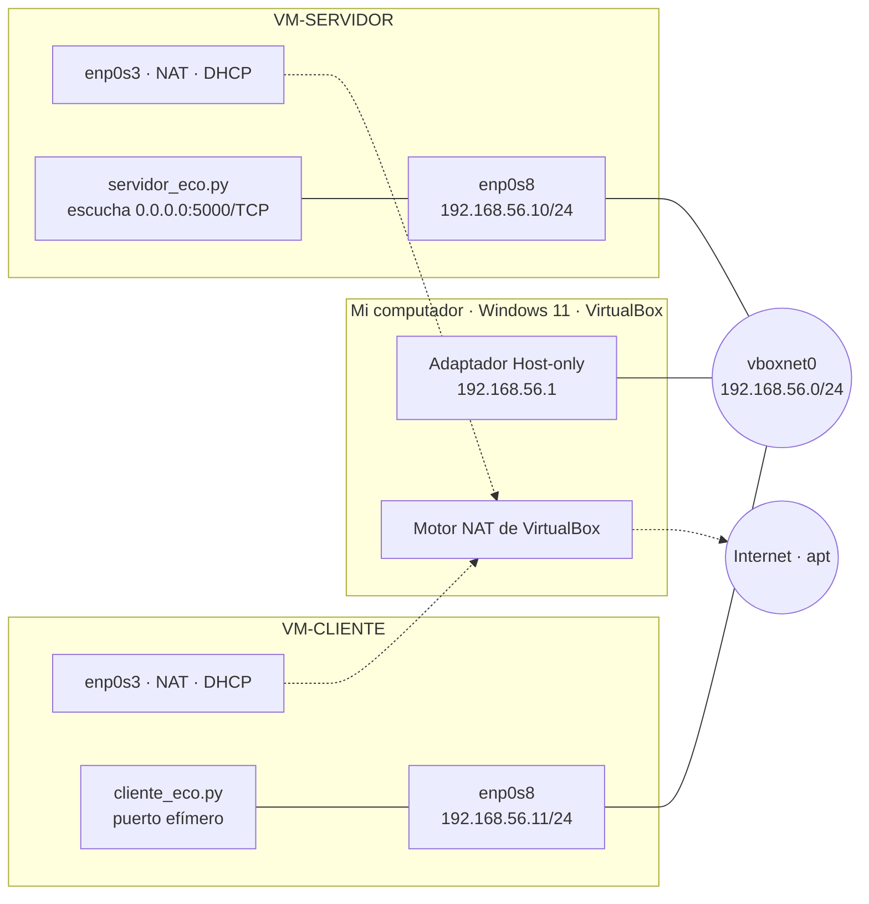
```mermaid
flowchart LR
    subgraph HOST["Mi computador · Windows 11 · VirtualBox"]
        HO["Adaptador Host-only<br/>192.168.56.1"]
        NAT["Motor NAT de VirtualBox"]
    end
    SW(("vboxnet0<br/>192.168.56.0/24"))
    subgraph VS["VM-SERVIDOR"]
        S8["enp0s8<br/>192.168.56.10/24"]
        S3["enp0s3 · NAT · DHCP"]
        SP["servidor_eco.py<br/>escucha 0.0.0.0:5000/TCP"]
    end
    subgraph VC["VM-CLIENTE"]
        C8["enp0s8<br/>192.168.56.11/24"]
        C3["enp0s3 · NAT · DHCP"]
        CP["cliente_eco.py<br/>puerto efímero"]
    end
    HO --- SW
    S8 --- SW
    C8 --- SW
    S3 -.-> NAT
    C3 -.-> NAT
    SP --- S8
    CP --- C8
    NAT -.-> INET(("Internet · apt"))
```

**Verificación por capas (Parte A.4).**

| Paso | Capa | Comando | Resultado obtenido |
|---|---|---|---|
| 1 | Enlace/Red | `ip -br addr` (ambas VM) | `enp0s8` `UP` con `192.168.56.10/24` (servidor) y `192.168.56.11/24` (cliente) |
| 2 | Red | `ping -c 4 192.168.56.10` | 4/4 recibidos, 0 % de pérdida; rtt mín/media/máx = 0,354 / 0,556 / 0,752 ms |
| 3 | Transporte | `nc -vz 192.168.56.10 5000` sin servidor | `Connection refused` |
| 4 | Transporte | `nc -vz 192.168.56.10 5000` con servidor | `succeeded!` |
| 5 | Transporte | `ss -ltnp` en VM-SERVIDOR | `LISTEN 0 1 0.0.0.0:5000 users:(("python3",pid=2408,fd=3))`; Send-Q = 1 es el `listen(1)` |
| 6 | Aplicación | `cliente_eco.py 192.168.56.10 5000` | envié `Hola` e `ingeniero`, recibí `HOLA` e `INGENIERO` |

<div class="g3">
<figure>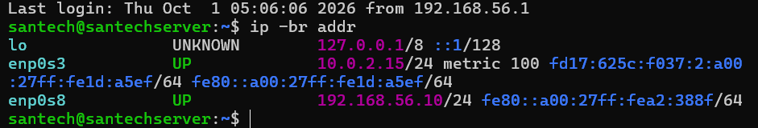<figcaption>A.1 ip -br addr, VM-SERVIDOR</figcaption></figure>
<figure>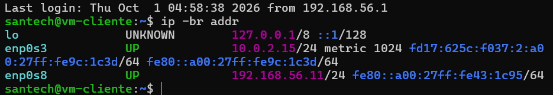<figcaption>A.1 ip -br addr, VM-CLIENTE</figcaption></figure>
<figure>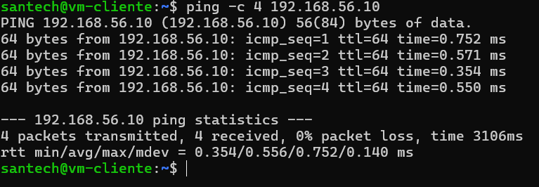<figcaption>A.2 ping</figcaption></figure>
<figure>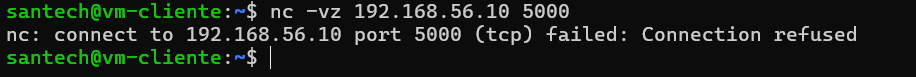<figcaption>A.3 nc sin servidor</figcaption></figure>
<figure><figcaption>A.4 nc con servidor</figcaption></figure>
<figure>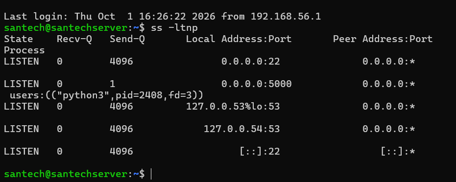<figcaption>A.5 ss -ltnp</figcaption></figure>
<figure>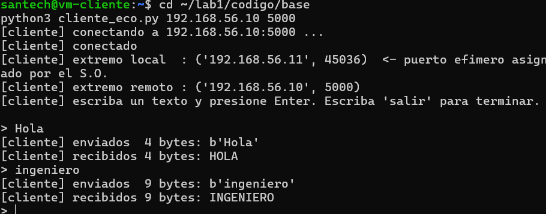<figcaption>A.6 eco, cliente</figcaption></figure>
<figure>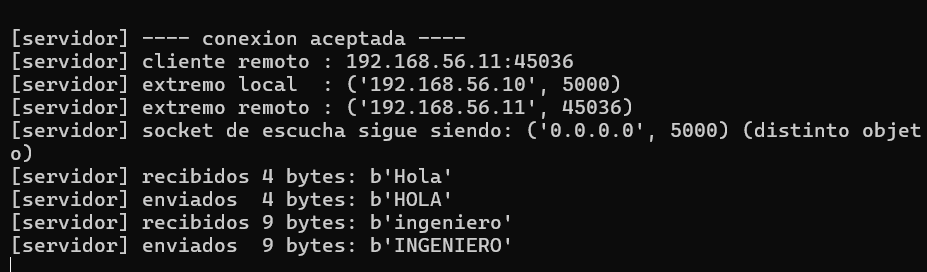<figcaption>A.6 eco, servidor</figcaption></figure>
</div>

**Cuádrupla de la primera conexión:** (192.168.56.11, 45036, 192.168.56.10, 5000), tomada de lo que imprimen `cliente_eco.py` y `servidor_eco.py`.

## 3. Desarrollo por experimento

Antes de ejecutar cada experimento anoté mi predicción. Los comandos exactos están en `experimentos/GUIA_E1_E6.md`. En las tablas, S1/S2 son terminales en VM-SERVIDOR y C1…C4 en VM-CLIENTE.

### 3.1 Tabla resumen: predicción / observación / explicación

| Exp. | Mi predicción (antes de ejecutar) | Lo que observé | Explicación |
|---|---|---|---|
| E1 | C2 y C3 quedarían esperando sin error, en una fila «como una pila», y recibirían su eco cuando C1 escribiera `salir`. | Sin error: `ss` mostró 3 filas ESTAB y la fila LISTEN con Recv-Q = 2. Al salir C1 se atendió a C2 y luego a C3: orden de llegada (FIFO), no pila. Un cuarto cliente no entró: `Connection timed out` a los 2 min 15 s. | Las conexiones solo difieren en el puerto efímero, y eso basta para que la cuádrupla sea única. El kernel completa el saludo y encola la conexión aunque la aplicación esté ocupada; con `listen(1)` caben 2 en la cola. |
| E2 | El socket de la conexión tendría un puerto distinto al 5000 (confundí socket con puerto). | Escucha en `0.0.0.0:5000`; conexión en `192.168.56.10:5000` ↔ `192.168.56.11:49114`. El puerto del servidor no cambió. | El socket de escucha está ligado a cualquier interfaz; el de la conexión pertenece a una cuádrupla concreta y tiene la IP por la que entró el SYN. |
| E3 | Al cerrar con `salir` saldría un «exit» o un error; sin el `break`, un error; con cierre brusco, un bucle que se cuelga. | `recv()` devolvió 0 y el servidor siguió vivo. Sin `break`: bucle infinito de `recibidos 0 bytes`, 58,4 % de CPU. Apagado brusco: S1 no se enteró, ESTAB más de 12 min, servidor bloqueado en `recv()`. | `recv()` = 0 solo significa que llegó un FIN; si no hay datos, `recv()` bloquea. Una VM apagada no envía FIN ni RST. |
| E4 | `recv()` entregaría los tres mensajes de la ráfaga de una sola vez. | En 11 conexiones, tres agrupaciones distintas (3+3+4, 3+7 y 6+4). Con pausa 0,5 s el servidor recibió 3+3+4 y el cliente los 10 bytes juntos. El servidor cayó con `ConnectionResetError` y `BrokenPipeError`. | TCP entrega los bytes completos y en orden, pero no conserva las fronteras de cada `sendall()`; la agrupación depende de la temporización. |
| E5 | No registré predicción antes de ejecutarlo. | Sin `SO_REUSEADDR`: `OSError: [Errno 98] Address already in use` durante unos 60 s. Con `SO_REUSEADDR`: reinicio inmediato con un TIME_WAIT activo. | Quien cierra primero queda en TIME_WAIT; sin la opción, el kernel no deja volver a hacer `bind()` a ese puerto. |
| E6 | Todos los fallos serían instantáneos y con errores distintos. | F1, F2 y F4: `conexion rechazada` en 0,04 s. F3: `No route to host` en 3,15 s. F5: `Connection timed out` en 2 min 12 s. | Fallo rápido: el destino respondió (RST). Fallo lento: nadie respondió (ARP fallido o SYN descartado). |

### 3.2 E1: la conexión tiene cuatro identificadores

Con S1 atendiendo a C1, y con C2 y C3 conectados, el servidor mostró:

```
$ ss -tn state established '( sport = :5000 )'        $ ss -ltn '( sport = :5000 )'
0  0  192.168.56.10:5000  192.168.56.11:58596   (C1)   State   Recv-Q  Send-Q  Local Address:Port
0  0  192.168.56.10:5000  192.168.56.11:52992   (C3)   LISTEN  2       1       0.0.0.0:5000
0  0  192.168.56.10:5000  192.168.56.11:52990   (C2)
```

| Conexión | IP origen | Puerto origen | IP destino | Puerto destino |
|---|---|---|---|---|
| C1 | 192.168.56.11 | 58596 | 192.168.56.10 | 5000 |
| C2 | 192.168.56.11 | 52990 | 192.168.56.10 | 5000 |
| C3 | 192.168.56.11 | 52992 | 192.168.56.10 | 5000 |

- **E1.1** Las tres comparten la IP y el puerto del servidor y la IP del cliente; solo cambia el puerto efímero.
- **E1.2** Al llegar un segmento, el kernel busca la conexión por la cuádrupla completa; cada puerto efímero identifica un socket de datos distinto, con sus propios búferes, y la respuesta sale por ese socket.
- **E1.3** Desde un mismo cliente hacia el mismo IP:puerto, la cuádrupla solo varía en el puerto de origen. En VM-CLIENTE medí `ip_local_port_range` = `32768 60999` (28 232 puertos) y `ulimit -n` = 1024: un solo proceso agota sus descriptores (unos 1020 sockets) mucho antes que los puertos.
- **E1.4** C2 y C3 no recibieron error: `connect()` terminó y enviaron `hola2` y `hola3`, pero el eco llegó a C2 al cerrarse C1, y a C3 al cerrarse C2. `listen(1)` fija el tamaño de la cola de conexiones ya establecidas, no cuántos clientes se atienden; el saludo lo completa el kernel y los datos esperan en el búfer del socket.
- **Predicción vs. resultado.** Acerté en la espera y fallé en la estructura: la cola de `accept()` es FIFO. Además, como el servidor es iterativo, C3 esperó también a C2.
- **Cuarto cliente.** Predije que C4 también entraría a la cola; no fue así. Con la cola llena (Recv-Q = 2, es decir `backlog + 1`), `ss` en el cliente mostró C4 en `SYN-SENT`, y terminó con `[Errno 110] Connection timed out` a los 2 min 15 s: el servidor descartó su SYN sin responder. Para el cliente, una cola llena se ve igual que un cortafuegos (F5). No lo verifiqué con `tcpdump`.

<div class="g2">
<figure>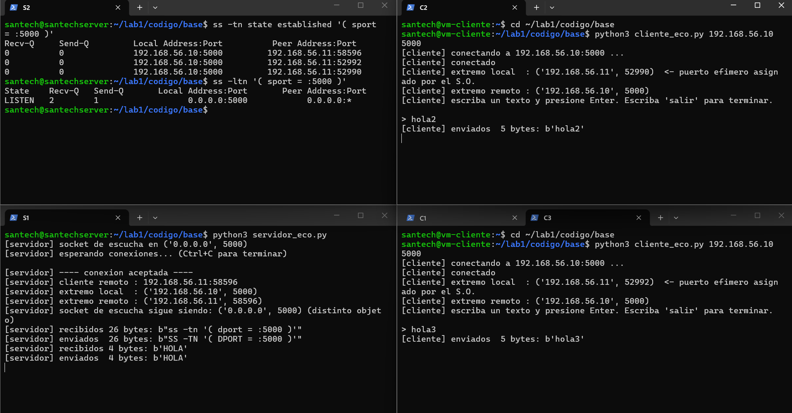<figcaption>E1: S1, S2 (ss), C2 y C3</figcaption></figure>
<figure>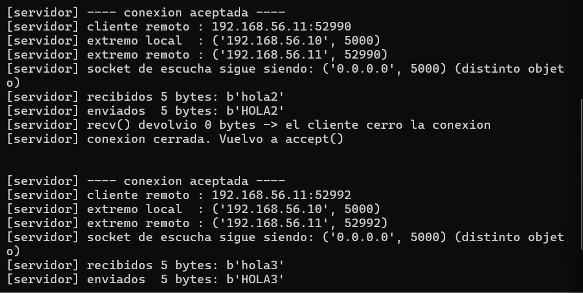<figcaption>E1: S1 atiende a C2 y luego a C3</figcaption></figure>
<figure>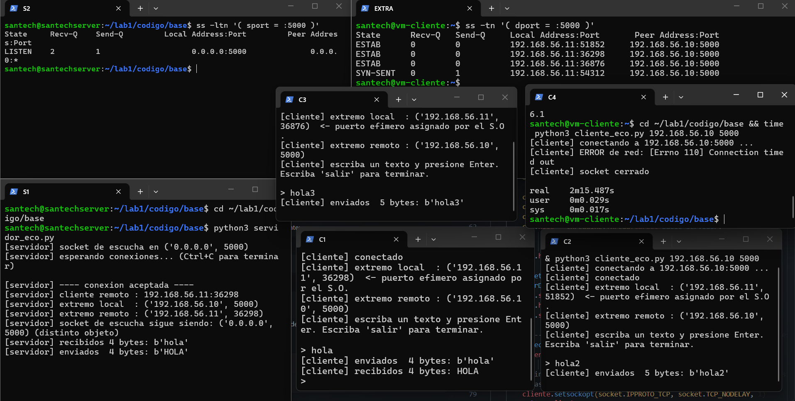<figcaption>E1: C4 en SYN-SENT y su timeout</figcaption></figure>
</div>

### 3.3 E2: el servidor maneja dos sockets distintos

| Socket | Dirección local | Puerto local | Extremo remoto |
|---|---|---|---|
| Escucha (LISTEN) | 0.0.0.0 | 5000 | 0.0.0.0:* |
| Conexión (ESTAB) | 192.168.56.10 | 5000 | 192.168.56.11:49114 |

S1 imprimió `extremo local: ('192.168.56.10', 5000)` y `socket de escucha sigue siendo: ('0.0.0.0', 5000) (distinto objeto)`, y `ss -tan` mostró las dos filas a la vez.

- **E2.1** El socket de escucha se ligó con `bind(("0.0.0.0", 5000))` y no tiene IP local concreta; el de la conexión sí, la IP por la que entró el SYN, porque forma parte de una cuádrupla.
- **E2.2** Un socket en LISTEN no tiene flujo de datos: `recv()` sobre él falla con `OSError` (ENOTCONN). Esto lo tomo de la documentación; no lo probé.
- **E2.3** Coincide con la cita de la guía: el socket de escucha nunca aparece en `recv()` ni `sendall()`; su único trabajo es producir un socket nuevo en cada `accept()`.
- **Predicción vs. resultado.** Predije otro puerto y me equivoqué: un socket no es un puerto. Los dos usan el 5000; el puerto que cambia es el del cliente.

<div class="g2">
<figure>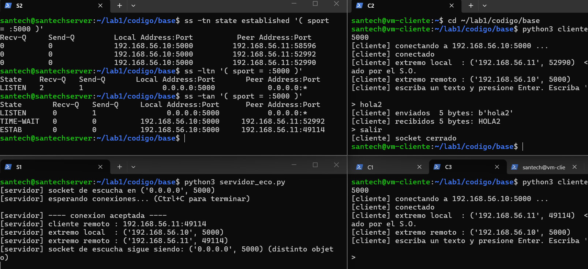<figcaption>E2: salida de S1 y ss -tan con LISTEN y ESTAB</figcaption></figure>
</div>

### 3.4 E3: qué significa que recv() devuelva cero

- **E3.1** Con `salir` y con Ctrl+C, S1 imprimió lo mismo: `recv() devolvio 0 bytes -> el cliente cerro la conexion` y `Vuelvo a accept()`. En los dos casos el cliente cierra el socket y su kernel envía un FIN. Predije un «exit» o un error, y no hubo ninguno.
- **E3.2** «No hay datos» hace que `recv()` bloquee y el proceso duerma; «0 bytes» es un retorno inmediato que significa que el otro extremo envió FIN. El programa los distingue porque en el primer caso `recv()` ni siquiera retorna.
- **E3.3** Sin el `if not datos: break` (copia `servidor_e3.py`), S1 repitió sin parar `recibidos 0 bytes: b''` / `enviados 0 bytes: b''`, y `top` mostró el proceso en estado `R` con **58,4 % de CPU** y 0 % de CPU inactiva en total. Predije un error o un cuelgue; fue lo contrario: no bloquea y consume CPU (*busy loop*), porque tras el FIN cada `recv()` retorna `b""` al instante.
- **E3.4** Apagué VM-CLIENTE de golpe (1:50 p. m. hora local, 18:50 UTC en las VM) con una conexión abierta. S1 no imprimió nada, y `ss -tno` mostró la conexión en **ESTAB** a las 18:57 y a las 19:02, sin temporizador. Un cliente nuevo se conectó pero no recibió eco: su fila mostró Recv-Q = 4 (los bytes de `hola` esperando en el kernel), porque el servidor seguía **bloqueado en `recv()`** con el cliente muerto. Mi predicción de que «se colgaría» se cumplió, pero por bloqueo, no por bucle. Una VM apagada no envía FIN ni RST, y el servidor, sin nada que enviar, no genera tráfico que revele la caída: sin keepalive la conexión queda medio abierta.

<div class="g2">
<figure>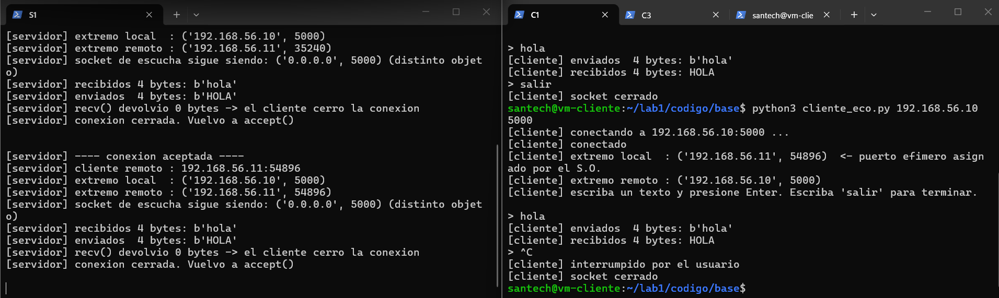<figcaption>E3.1: cierre con salir y con Ctrl+C</figcaption></figure>
<figure>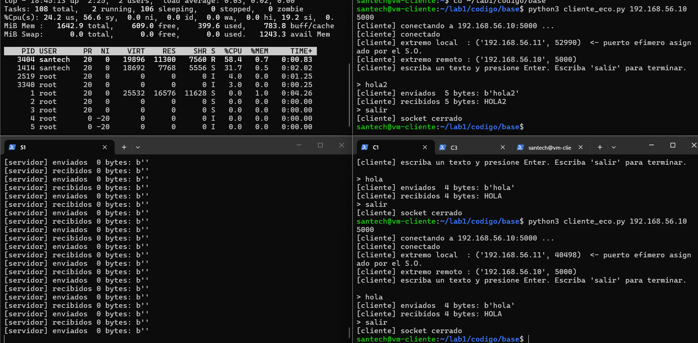<figcaption>E3.3: bucle sin break y top</figcaption></figure>
<figure>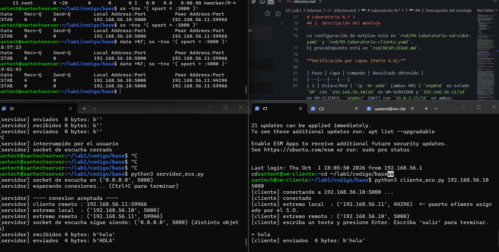<figcaption>E3.4: apagado brusco, ss -tno</figcaption></figure>
</div>

### 3.5 E4: TCP es un flujo de bytes

| Corrida | Pausa | `recv()` del servidor (bytes) | `recv()` del cliente |
|---|---|---|---|
| 1 | 0 | 3 `uno` + 7 `dostres` | `UNO` (3 B) |
| 2 | 0,5 | 3 `uno` + 3 `dos` + 4 `tres` | `UNODOSTRES` (10 B) |
| 3 | 0 | 6 `unodos` + 4 `tres` | `UNODOS` (6 B) |
| 4 | 0 | 3 `uno` + 7 `dostres` | `UNO` (3 B) |
| 5 | 0 | 6 `unodos` + 4 `tres` | `UNODOS` (6 B) |
| 6 | 0 | 3 `uno` + 7 `dostres`, y el servidor cae con `ConnectionResetError` | `UNO` (3 B) |
| 7 | 0 | servidor caído | `[Errno 111] Connection refused` |

| Agrupación en el servidor (11 conexiones registradas) | Veces |
|---|---|
| 3 + 3 + 4 (`uno`, `dos`, `tres`) | 3 |
| 3 + 7 (`uno`, `dostres`) | 6 |
| 6 + 4 (`unodos`, `tres`) | 2 |

En todas las conexiones llegaron los 10 bytes y en orden, pero el mismo código y el mismo cliente dieron tres agrupaciones distintas. Con pausa 0,5 s, el servidor los recibió separados y el único `recv()` del cliente devolvió los tres ecos juntos: llegar separados a un lado no garantiza llegar separados al otro. El servidor cayó con `ConnectionResetError` en 3 de las 11 conexiones, y en una segunda tanda con `BrokenPipeError` en `sendall()`; después, los clientes siguientes recibieron `Connection refused`. Mi explicación es que el cliente hace un solo `recv()` y cierra con bytes del eco sin leer, y su kernel responde con RST; según cuándo llegue el RST, el error sale al leer o al escribir. No lo confirmé con `tcpdump`.

- **E4.1** No se perdió ni se desordenó ningún byte (suma = 10 en todas); lo que no se conserva es la frontera entre `sendall()`.
- **E4.2** Los bytes «extra» esperaban en el búfer de recepción del socket del cliente, en el kernel: llegaron, se confirmaron con ACK y quedaron en cola hasta el `recv()`.
- **E4.3** Las corridas no fueron iguales. Los errores que dependen de la temporización (carga, planificador, latencia) hacen que el mismo código pase una prueba y falle la siguiente: «a mí me funcionó una vez» no prueba nada.
- **E4.4** «Fiable y en orden» explica que lleguen los 10 bytes en su orden; «flujo de bytes» es justamente lo que nunca prometió conservar mensajes.
- **E4.5** La documentación de Python nombra cuatro estrategias: longitud fija, delimitador, prefijo de longitud y cerrar la conexión. Para transferencias bancarias elegiría el **prefijo de longitud**: admite cualquier contenido sin escapar caracteres, el receptor sabe cuánto leer y puede rechazar tamaños absurdos. En R2 usé delimitador porque el contenido es una línea de texto.
- **E4.6** Corresponde a la estrategia de **indicar la longitud** en la cabecera.
- **Predicción vs. resultado.** Predije una sola entrega y obtuve tres agrupaciones; con pausa 0,5 s acerté para el servidor pero no para el cliente.

<div class="g2">
<figure>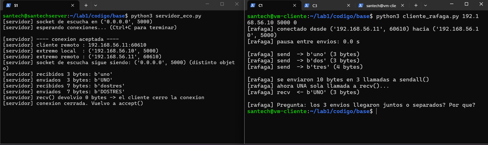<figcaption>E4 corrida 1 (pausa 0)</figcaption></figure>
<figure>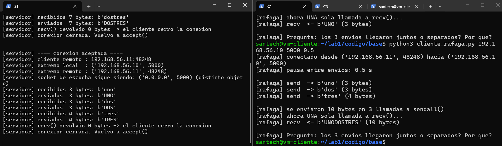<figcaption>E4 corrida 2 (pausa 0,5)</figcaption></figure>
<figure>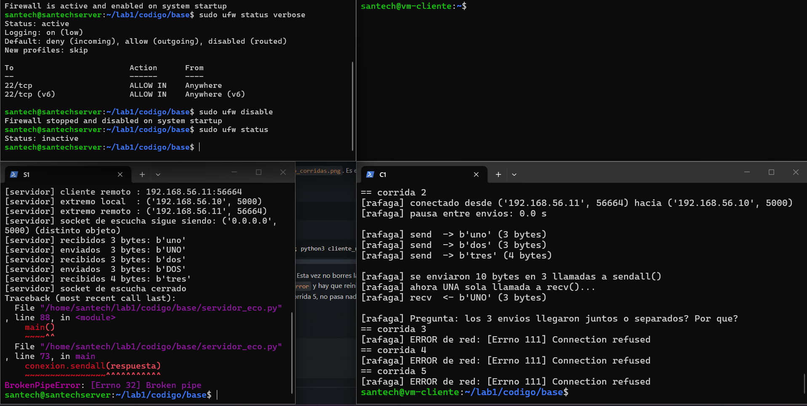<figcaption>E4: bucle de 5 corridas y BrokenPipeError</figcaption></figure>
</div>

### 3.6 E5: TIME_WAIT y SO_REUSEADDR

- **E5.1** Con la copia sin `SO_REUSEADDR` (`servidor_e5.py`), al reiniciar justo después de cerrar con Ctrl+C: `OSError: [Errno 98] Address already in use` en `servidor.bind((HOST, PUERTO))`.
- **E5.2** Cerré primero el servidor y después el cliente, así que el TIME_WAIT quedó del lado del servidor. A las 19:27:31 `ss -tano` mostró `TIME-WAIT 192.168.56.10:5000 ↔ 192.168.56.11:49094` con `timer:(timewait,56sec,0)`; el bucle que probaba `bind()` cada segundo pudo hacerlo a las 19:28:31. En total, unos 60 s, que coinciden con 2·MSL fijado en Linux (`TCP_TIMEWAIT_LEN`). La diferencia de unos 4 s frente al temporizador la atribuyo a la espera de 1 s del bucle y al arranque de Python, sin haberlo comprobado. Con `servidor_eco.py` (con la opción) repetí el cierre: había un TIME_WAIT con `timewait,55sec` y el servidor arrancó de inmediato.
- **E5.3** Si la misma cuádrupla se reutilizara enseguida, un segmento retrasado de la conexión anterior podría entrar en la nueva como válido; TIME_WAIT también permite retransmitir el último ACK si el FIN se repite.
- **E5.4** El riesgo es aceptar esos segmentos rezagados, poco probable porque también tendrían que caer en la ventana de secuencia. Se acepta porque un servidor no puede quedar fuera de servicio un minuto en cada reinicio, y cada cliente nuevo llega con otro puerto efímero, es decir, con otra cuádrupla.

<div class="g2">
<figure>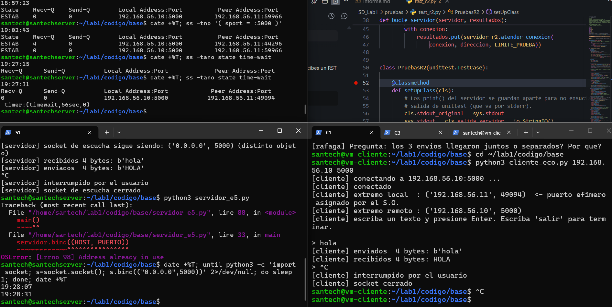<figcaption>E5: Errno 98, TIME-WAIT y la medición</figcaption></figure>
<figure>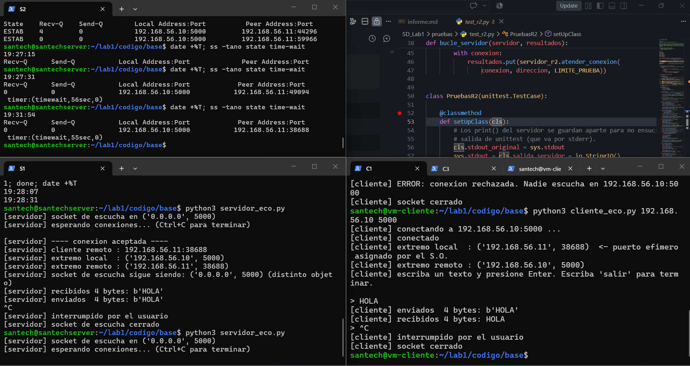<figcaption>E5: con SO_REUSEADDR arranca de inmediato</figcaption></figure>
</div>

### 3.7 E6: diagnóstico por capas

| # | Fallo | Error exacto | Tiempo | ¿Qué respondió el destino? | Capa |
|---|---|---|---|---|---|
| F1 | Servidor detenido | `conexion rechazada` (`ConnectionRefusedError`) | 0,046 s | Rechazo inmediato; `ss -ltnp` sin nada en :5000 | Transporte |
| F2 | Puerto 5001 | `conexion rechazada` (`ConnectionRefusedError`) | 0,041 s | Rechazo inmediato; el servidor escuchaba en :5000 | Transporte |
| F3 | IP 192.168.56.99 | `[Errno 113] No route to host` | 3,152 s | Nadie; `ip neigh` mostró la IP en `FAILED` (ARP sin respuesta) | Enlace/red |
| F4 | `HOST = "127.0.0.1"` | `conexion rechazada` (`ConnectionRefusedError`) | 0,042 s | Rechazo inmediato; `ss -ltnp` mostró `127.0.0.1:5000` y `nc` local funcionó | Aplicación (configuración) |
| F5 | `ufw` activo | `[Errno 110] Connection timed out` | 2 min 12,5 s (repetido: 2 min 12,8 s) | Nada; `ufw status verbose`: `deny (incoming)` y solo `22/tcp` permitido | Red/transporte (filtrado) |

Mi predicción («todos al instante, con errores distintos») solo se cumplió en F1, F2 y F4, y esos tres dieron **el mismo** error: desde el cliente son indistinguibles, y solo `ss -ltnp` en el servidor separa «no hay proceso» (F1), «otro puerto» (F2) y «escucha solo en loopback» (F4). F3 no es un timeout de TCP, como sugería la guía: el cliente ni siquiera envía el SYN porque el ARP de 192.168.56.99 fracasa (los ~3 s son compatibles con 3 sondeos ARP de 1 s, que no verifiqué). En F5 el cortafuegos descarta el SYN sin responder y el cliente reintenta con esperas crecientes; el tiempo fue estable en dos mediciones porque lo fija el número de reintentos de SYN del kernel.

- **E6.2** En F1 la máquina existe y su kernel responde al SYN con un RST porque nadie escucha: el error llega al instante. En F3 no hay ningún equipo con esa IP, y el fallo ocurre antes, en ARP.
- **E6.3** En el servidor, `ss -ltnp` (¿hay alguien en :5000?) y `sudo ufw status verbose` (¿hay una regla que filtra?); con `tcpdump` se vería si el SYN llega y si sale un RST.
- **E6.4** Con 127.0.0.1 el socket solo coincide con paquetes dirigidos al loopback; el SYN que entra por `enp0s8` no coincide con ningún socket en escucha y el kernel responde RST, igual que en F1 aunque el proceso esté vivo.
- **E6.5** Tabla de diagnóstico:

| Síntoma | Capa | Comando que lo confirma |
|---|---|---|
| Sin IP en `enp0s8` o interfaz DOWN | Enlace/red | `ip -br addr` |
| `ping` falla o `No route to host` | Red | `ping`, `ip route`, `ip neigh` |
| `ping` funciona, conexión rechazada al instante | Transporte (nadie escucha en ese IP:puerto) | `ss -ltnp` en el servidor |
| `ping` funciona, la conexión espera hasta un timeout | Red/transporte (filtrado o cola llena) | `sudo ufw status`, `ss -ltn` (Recv-Q), `tcpdump` |
| Conecta pero la respuesta es incorrecta o no llega | Aplicación | salida de los programas, `ss -tn` (Recv-Q/Send-Q) |

<div class="g3">
<figure>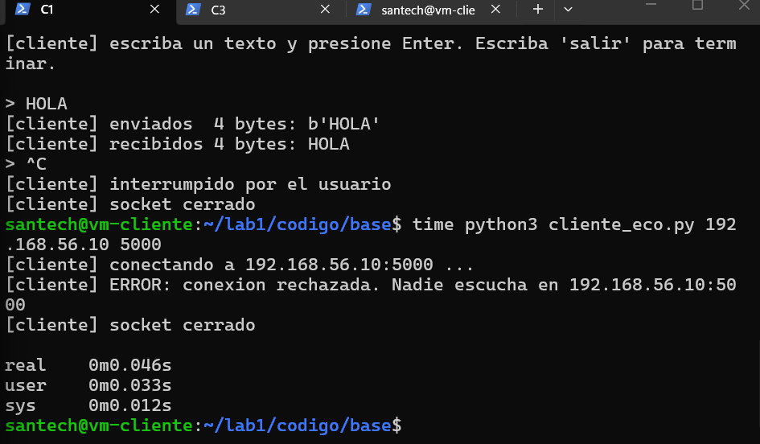<figcaption>F1: cliente</figcaption></figure>
<figure>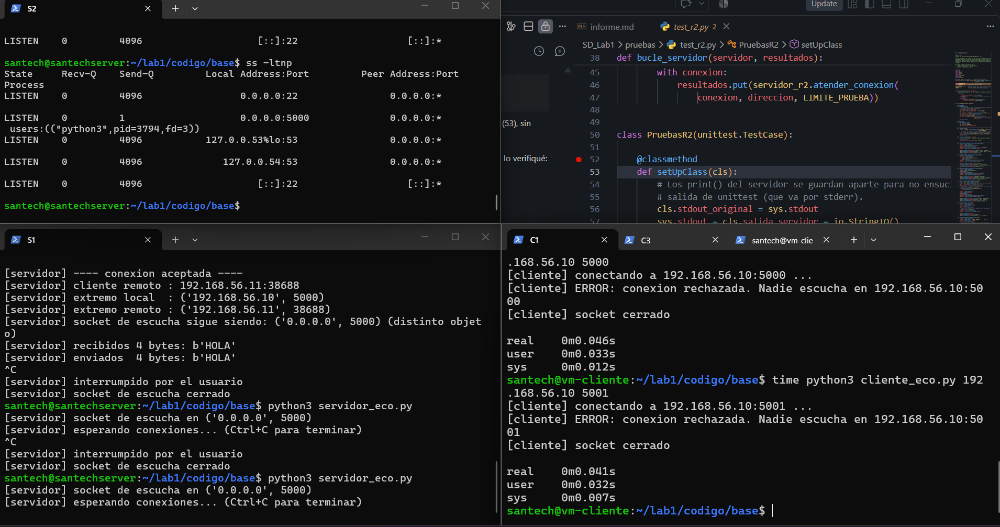<figcaption>F2: puerto 5001</figcaption></figure>
<figure>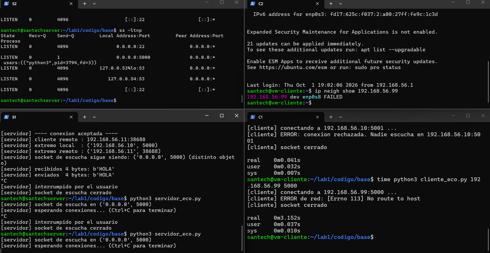<figcaption>F3: No route to host, ip neigh FAILED</figcaption></figure>
<figure>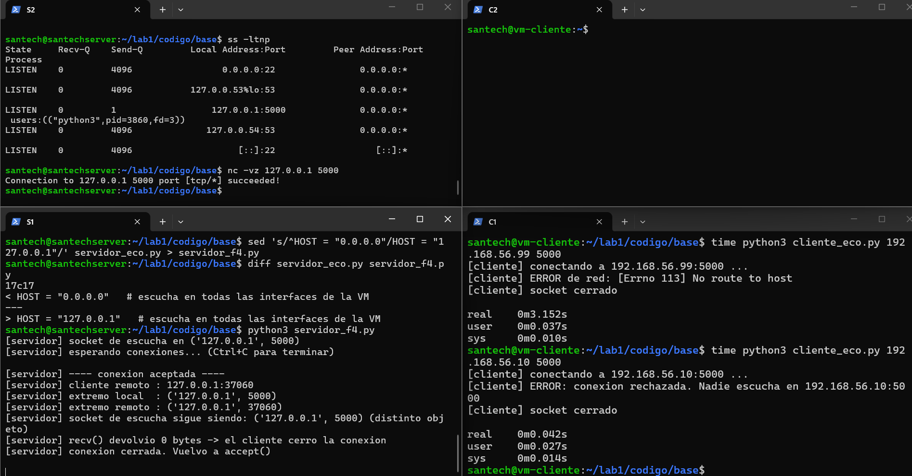<figcaption>F4: solo 127.0.0.1</figcaption></figure>
<figure>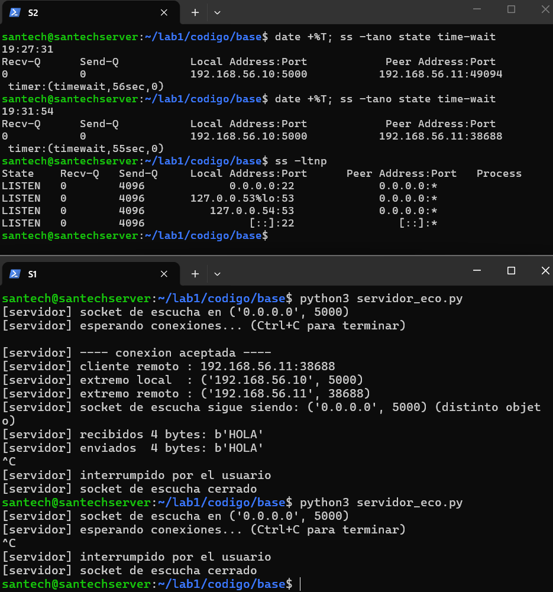<figcaption>F1: ss -ltnp en el servidor</figcaption></figure>
<figure>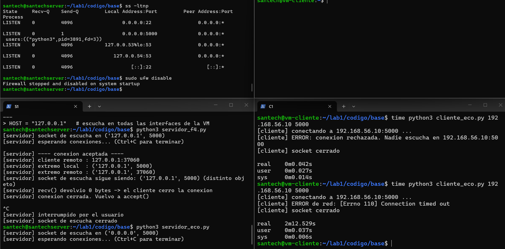<figcaption>F5: Connection timed out</figcaption></figure>
<figure>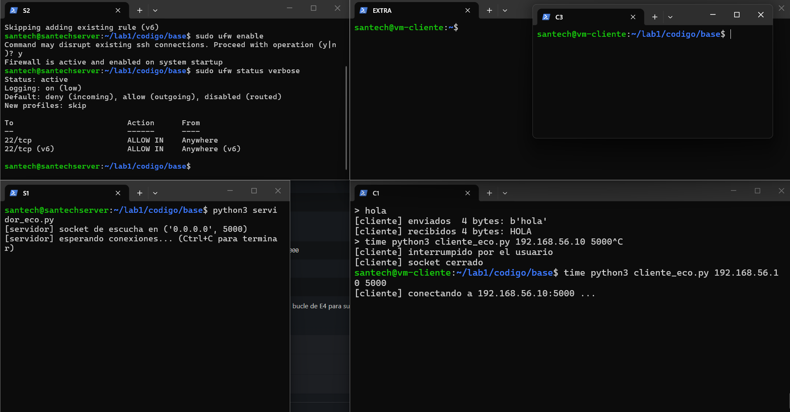<figcaption>F5: ufw status verbose</figcaption></figure>
<figure>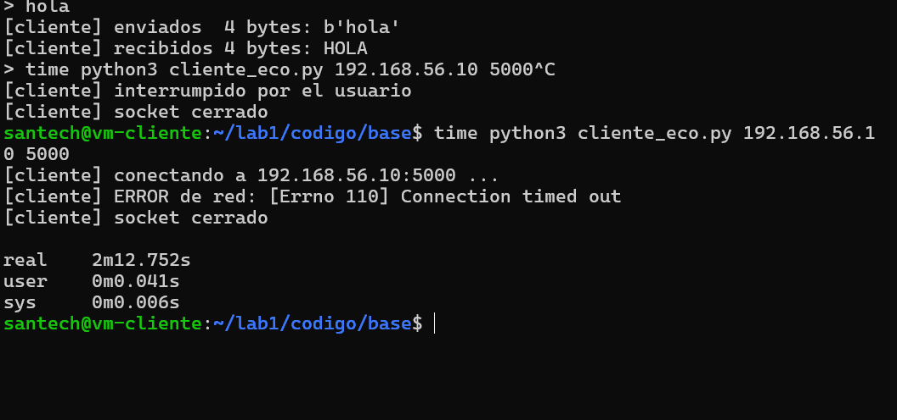<figcaption>F5: repetición</figcaption></figure>
</div>

## 4. Retos de implementación

### 4.1 R1: registro de conexiones (`codigo/r1/servidor_r1.py`)

Cada conexión agrega a `bitacora.log` una línea `<inicio ISO 8601> cliente=<ip>:<puerto> mensajes=<n> bytes_recibidos=<n> bytes_enviados=<n> cierre=<normal|error>`. Obtengo la IP y el puerto con `getpeername()` sobre el socket de `accept()`; escribo la línea en un `finally`, así que queda registrada también si la conexión termina con `ConnectionResetError`; abro el archivo en modo *append* y lo cierro en cada escritura para que el registro sobreviva a una caída del servidor. `bytes_enviados` solo suma cuando `sendall()` retorna sin error, porque `sendall()` entrega todo o lanza excepción. Como el servidor de eco no tiene fronteras, un «mensaje» es un `recv()` con datos, que puede no coincidir con los `sendall()` del cliente (E4). Ejecución en las VM, con un cliente de eco y una ráfaga:

```
2026-10-01T20:26:04+00:00 cliente=192.168.56.11:51012 mensajes=1 bytes_recibidos=46 bytes_enviados=46 cierre=normal
2026-10-01T20:26:27+00:00 cliente=192.168.56.11:54034 mensajes=3 bytes_recibidos=10 bytes_enviados=10 cierre=normal
```

La primera línea son 46 bytes porque en esa sesión escribí como texto el comando de la ráfaga; la segunda es la ráfaga (3 mensajes, 10 bytes). En mi prueba previa en Windows una conexión cerrada con RST quedó registrada como `cierre=ConnectionResetError`, lo que confirma el `finally`.

### 4.2 R2: protocolo con fronteras de mensaje (`codigo/r2/`)

Cada mensaje es texto UTF-8 terminado en `\n` y la respuesta es el texto en mayúsculas terminado en `\n`. Si se superan 64 KiB sin `\n`, el servidor responde `ERROR ...` y cierra. Decisiones de diseño: (1) el búfer se declara **fuera** del bucle de `recv()` para conservar el pedazo que sobra; (2) extraigo con `while b"\n" in buffer` y no con `if`, porque un `recv()` puede traer varios mensajes; (3) `split(b"\n", 1)` corta solo en el primer `\n`; (4) trabajo en bytes y decodifico solo el mensaje completo, así un carácter multibyte partido entre dos `recv()` ya está entero; (5) el límite evita que un cliente sin `\n` llene la memoria; (6) el residuo sin `\n` al cerrar se descarta y se informa, porque procesarlo sería inventar una frontera; (7) el cliente usa el mismo mecanismo (`LectorLineas`); (8) el mensaje vacío viaja como `b"\n"` y ya no bloquea, a diferencia del `clientep.py` original.

En VM-SERVIDOR, `python3 -m unittest -v pruebas.test_r2` pasó las **7 pruebas** (`Ran 7 tests in 0.540s`, `OK`): tres mensajes en un solo `sendall`, byte por byte, mensaje dividido en dos envíos, carácter multibyte partido, mensaje vacío, desbordamiento del límite y residuo al cerrar. Para comprobar que las pruebas detectan errores reales, las ejecuté contra copias del servidor con fallos introducidos a propósito:

| Fallo introducido | Prueba que lo detecta |
|---|---|
| `if` en lugar de `while` | test_1 |
| Búfer reiniciado en cada `recv()` | test_2, test_3 y test_4 |
| Decodificar cada `recv()` | test_4 |

Con la misma ráfaga de E4 (`cliente_rafaga_r2.py ... 0`) en las VM, el servidor hizo **2 `recv()`** (`uno\n` y luego `dos\ntres\n`) y aun así identificó **3 mensajes**; el cliente recibió `UNO`, `DOS` y `TRES` por separado, y el servidor no se cayó. TCP agrupa igual que antes, pero ahora el delimitador permite reconstruir los mensajes.

<div class="g2">
<figure>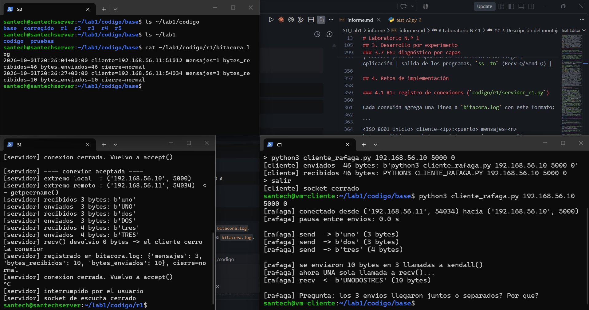<figcaption>R1: bitacora.log en VM-SERVIDOR</figcaption></figure>
<figure>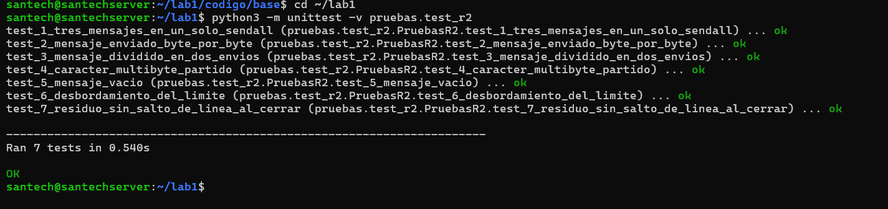<figcaption>R2: 7 pruebas OK en VM-SERVIDOR</figcaption></figure>
</div>
<div class="g2">
<figure>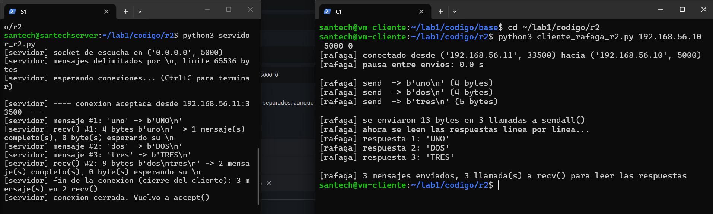<figcaption>R2: 3 mensajes en 2 recv()</figcaption></figure>
<figure>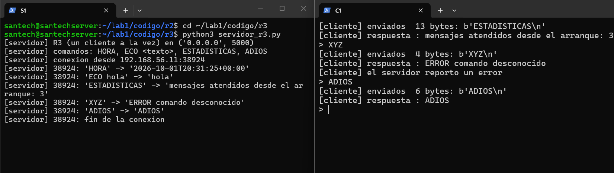<figcaption>R3: comandos en las VM</figcaption></figure>
</div>

### 4.3 Retos adicionales (R3, R4, R5) y versión corregida

**R3: comandos** (`codigo/r3/servidor_r3.py`), sobre el protocolo de líneas de R2. Resultados en las VM:

| Comando | Respuesta del servidor |
|---|---|
| `HORA` | `2026-10-01T20:31:25+00:00` |
| `ECO hola` | `hola` |
| `ESTADISTICAS` | `mensajes atendidos desde el arranque: 3` (cuenta `HORA`, `ECO` y la propia consulta) |
| `XYZ` | `ERROR comando desconocido`; la sesión sigue abierta |
| `ADIOS` | `ADIOS` y el servidor cierra la conexión |

**R4: varios clientes** (`codigo/r4/servidor_r4.py`). El hilo principal solo ejecuta `accept()` y cada conexión se atiende en su propio `threading.Thread`. En las VM dejé C1 conectado sin escribir, y C2 y C3 recibieron la respuesta a `HORA` de inmediato (20:35:09 y 20:35:14); el servidor llegó a 4 hilos de clientes. Predije que C2 respondería «porque C1 no tiene ninguna solicitud»; acerté el resultado, pero la causa es otra: en E1 C1 también estaba callado y C2 esperó. Lo que cambia es que ya no hay un único hilo bloqueado en el `recv()` de C1. La comparación con R3 no la repetí en las VM; en mi prueba previa, con A conectado 2 s, B y C recibieron su respuesta a los 2,01 s con R3 y a los 0,20 s con R4.

El contador de `ESTADISTICAS` es compartido: `valor += 1` es leer, sumar y escribir, y dos hilos pueden pisarse (condición de carrera). Lo protegí con un `threading.Lock` (`ContadorSeguro`). Resultado de `demo_carrera.py` en VM-SERVIDOR (8 hilos × 2000 incrementos):

| Caso | Esperado | Obtenido | Perdidos | Tiempo |
|---|---|---|---|---|
| 1. Sin Lock (`valor += 1`) | 16000 | 16000 | 0 | 0,01 s |
| 2. Sin Lock, ventana leer/escribir ampliada con `time.sleep(0)` | 16000 | 2002 | 13998 | 0,21 s |
| 3. Con Lock, misma ventana | 16000 | 16000 | 0 | 1,57 s |

Predije que se perderían incrementos; solo ocurrió al ampliar la ventana. Lo importante es la fila 1: sin Lock **la prueba pasa**, porque el cambio de hilo justo entre leer y escribir es raro; por eso este error sobrevive a las pruebas y aparece bajo carga. El Lock evita las pérdidas a cambio de tiempo.

**R5: RTT** (`codigo/r5/cliente_rtt.py`, contra `servidor_r2.py`). Medí cada mensaje con `time.perf_counter()` del cliente, desde antes de `sendall()` hasta tener la respuesta completa, sobre una sola conexión para que el saludo no entre en la medición.

| Tamaño | N | Mín (ms) | Máx (ms) | Media (ms) |
|---|---|---|---|---|
| 10 B (VM) | 100 | 0,308 | 2,752 | 0,735 |
| 8000 B (VM) | 100 | 0,887 | 4,736 | 1,971 |
| *10 B (mi computador, loopback, referencia)* | 100 | 0,017 | 0,168 | 0,025 |
| *8000 B (mi computador, loopback, referencia)* | 100 | 0,109 | 0,655 | 0,178 |

Como predije, 8000 B tarda más: su media es 2,7 veces la de 10 B en las VM (7,1 veces en loopback). Un mensaje de 8000 B no cabe en un segmento (MSS ≈ 1460 B) y el servidor lo lee en varios `recv()` de 1024 B. En las VM la diferencia relativa es menor porque el costo fijo por mensaje (red virtual, planificación) es unas 30 veces mayor y pesa más en los mensajes pequeños. El máximo es 2,4 a 3,7 veces la media por interrupciones del sistema y la virtualización.

<div class="g2">
<figure>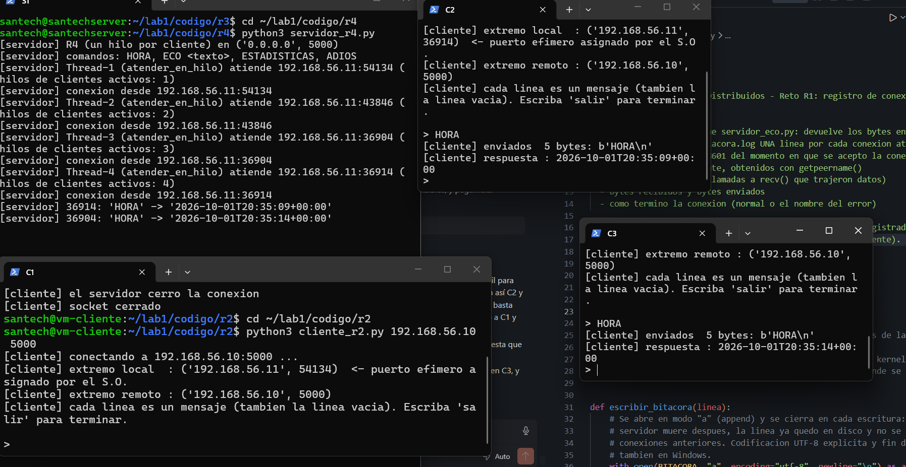<figcaption>R4: C2 y C3 atendidos con C1 callado</figcaption></figure>
<figure>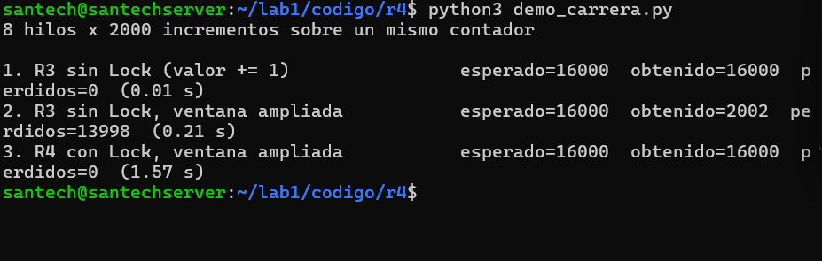<figcaption>R4: demo de la carrera</figcaption></figure>
<figure>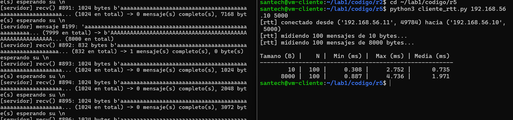<figcaption>R5: tabla de RTT en las VM</figcaption></figure>
</div>

**Versión corregida de `serverp.py` / `clientep.py`** (`codigo/corregido/`).

| Problema del original | Corrección |
|---|---|
| `bind` a la IP fija 172.16.0.64 (en mi computador falla con `WinError 10049`) | `0.0.0.0` |
| Puerto 12345 fijo; sin `SO_REUSEADDR` | 5000 configurable; se activa la opción |
| Un mensaje vacío produce `sendall(b"")`, que no envía nada, y los dos extremos quedan bloqueados en `recv()` | cada mensaje termina en `\n`; el vacío viaja como `b"\n"` |
| Un solo `recv(1024)` por mensaje | búfer y lectura de líneas completas |
| Sin detección de cierre ni manejo de errores | se detecta `recv()` = `b""`, se capturan los errores de conexión y se cierra con `with`/`finally` |

## 5. Respuestas a las preguntas de comprensión

**1. ¿Qué es un socket y en qué se diferencia de un puerto?** Un socket es el objeto con el que un proceso habla por la red: para mi programa, un descriptor de archivo; para el kernel, una estructura con estado, búferes y direcciones local y remota. Un puerto es solo un número de 16 bits que forma parte de la dirección. Muchos sockets comparten el puerto 5000: en E2 el de escucha estaba en `0.0.0.0:5000` y el de la conexión en `192.168.56.10:5000`. Yo creía que cambiaría el puerto, y lo que cambió fue la dirección local.

**2. ¿Por qué cuatro valores y no dos?** Con IP y puerto del servidor, las tres conexiones de E1 serían idénticas (192.168.56.10:5000); añadir la IP del cliente tampoco basta, porque las tres venían de 192.168.56.11. Solo el puerto efímero (58596, 52990, 52992) las distingue.

**3. El cliente no hace `bind()`: ¿no tiene puerto?** Sí tiene: `connect()` hace un *bind* implícito con un puerto libre del rango efímero (en VM-CLIENTE, 32768–60999). Lo vi cambiar en cada ejecución: 45036, 58596, 52990, 49114, 38688.

**4. Orden de las llamadas y cuáles bloquean.** Servidor: `socket()` → `setsockopt()` → `bind()` → `listen()` → `accept()`* → `recv()`* / `sendall()`* → `close()`. Cliente: `socket()` → `connect()`* → `sendall()`* → `recv()`* → `close()` (* = puede bloquear). «Bloqueante» significa que el kernel saca al proceso de la cola de ejecución hasta que ocurre el evento esperado, sin consumir CPU; `sendall()` solo bloquea si el búfer de envío está lleno. El contraste lo vi en E3.3: sin el `break`, `recv()` dejó de bloquear y el proceso pasó a estado `R` con 58,4 % de CPU. No medí la CPU del servidor mientras esperaba.

**5. ¿Qué ocurre entre `connect()` y el retorno de `accept()`? ¿Cuánto programé?** El kernel del cliente resuelve la MAC por ARP si hace falta y envía un SYN; el del servidor responde SYN-ACK y el cliente cierra con ACK. Ahí `connect()` retorna y la conexión queda en la cola de `listen()`; `accept()` solo la saca y crea el descriptor. No programé nada de eso. Lo vi en E1: C2 y C3 quedaron en ESTAB sin que se llamara a `accept()` para ellos.

**6. ¿Por qué `accept()` devuelve un socket nuevo?** Porque el de escucha debe seguir en LISTEN para los próximos clientes, y cada conexión necesita su cuádrupla, su estado y sus búferes. En E2 `ss` mostró las dos filas a la vez y el servidor reportó objetos distintos.

**7. «TCP no conserva las fronteras», con datos de E4.** Tres `sendall()` produjeron en el servidor dos o tres `recv()` según la corrida (3+3+4, 3+7, 6+4), y con pausa 0,5 s el cliente recibió los tres ecos en un solo `recv()`. Siempre llegaron 10 bytes en orden.

**8. Tres cosas que TCP no garantiza.** (a) Que cada `send()` llegue en un `recv()` separado (E4). (b) Que el otro extremo se entere pronto de una caída: en E3.4 la conexión siguió en ESTAB más de 12 minutos. (c) Cuándo llegan los datos: no hay límite de latencia, y un ACK solo dice que el kernel remoto recibió los bytes, no que la aplicación los procesó.

**9. ¿Por qué `sendall()` es preferible a `send()`?** `send()` puede aceptar solo una parte de los bytes y deja el resto al programador; `sendall()` repite `send()` hasta entregar todo o lanza excepción, aunque entonces no se sabe cuántos bytes salieron. En R5 cada mensaje de 8000 B salió con un solo `sendall()` y el servidor lo leyó en varios `recv()` de 1024 B.

**10. Si TCP es fiable, ¿por qué delimitar mensajes?** Porque fiabilidad y fronteras son cosas distintas: TCP garantiza qué bytes llegan y en qué orden, no dónde termina cada mensaje. Esa información solo existe en la aplicación. R2 funciona porque ninguna capa inferior lo hacía: 2 `recv()`, 3 mensajes.

**11. REST/gRPC: ¿desaparecen esas llamadas?** No, quedan ocultas: la biblioteca cliente ejecuta `socket()`, `connect()`, `send()` y `recv()`, y el kernel sigue haciendo el saludo. HTTP/2 y gRPC resuelven el problema de E4 con marcos que indican su longitud. Esto lo razono desde la documentación; no lo comprobé con `strace`.

**12. Tres problemas que este laboratorio no enfrenta.** (a) Fallos parciales: un nodo cae y el otro no lo sabe (E3.4 es un anticipo); hacen falta timeouts y detección de fallos. (b) Ausencia de reloj global: me pasó al comparar mi hora local (UTC-5) con la de las VM (UTC) en E3.4. (c) Serialización de datos estructurados: aquí solo viaja texto; enviar estructuras exige acordar un formato (JSON, Protobuf) y el orden de bytes. También quedan fuera la seguridad (todo viaja en claro) y la concurrencia en los servidores iterativos.

**13. Acuerdos escritos e implícitos.** Escritos: la dirección y el puerto (`HOST`, `PUERTO` y argumentos) y la codificación UTF-8, pero escrita dos veces, una por programa, sin contrato común. Implícitos: el significado del mensaje (eco en mayúsculas, dónde termina, qué es un error). El riesgo es que si un extremo cambia, el otro falla en silencio. Ejemplo real: `servidor_eco.py` aplica `.upper()` sobre bytes, y en mi prueba en Windows «mañana» volvió como `MAñANA`.

**14. Si cambiara TCP por UDP.** Dejaría de haber conexión y saludo, garantía de entrega y orden, y control de flujo y congestión. UDP sí conserva fronteras (cada `sendto()` es un datagrama), así que lo de E4 desaparecería, y `recv()` = 0 ya no significaría «cerró». Tendría que implementar yo números de secuencia, confirmaciones con retransmisión, detección de duplicados y un límite de tamaño por mensaje.

## 6. Dificultades encontradas y cómo se resolvieron

1. **SSH no estaba disponible al principio.** `systemctl status ssh` respondió `Unit ssh.service could not be found` y luego mostró el servicio `inactive (dead)`, activado solo por `ssh.socket`. Lo resolví siguiendo el paso a paso de `red/DESPLIEGUE.md`.
2. **Netplan y el clon.** El archivo de las VM era `/etc/netplan/60-hostonly.yaml` y no el nombre del documento de despliegue, y al guardarlo en nano escribí mal el nombre (`60-hostonly.yamlrr`). VM-CLIENTE, por ser un clon, conservaba el nombre `santechserver` y la IP .10: escribí `hostnamectl set-hostname -vm-cliente` con un guion de más (`invalid option -- 'v'`) y usé una ruta equivocada en `sed`, antes de lograr `vm-cliente` y `192.168.56.11/24`. Lo corregí siguiendo el paso a paso y lo comprobé con `ip -br addr`.
3. **Relojes distintos.** Las VM usan UTC y mi computador UTC-5; para medir E3.4 tuve que convertir la hora del apagado.
4. **Errores al ejecutar.** Corrí `cliente_eco.py` sin `python3` y desde la carpeta equivocada, intenté ejecutar `servidor_e3.py` antes de crearlo con `sed`, y en E1 pegué un comando `ss` dentro del cliente, que se envió como mensaje. Lo resolví trabajando desde `~/lab1/codigo/base` y repitiendo cada paso en la terminal correcta.
5. **El servidor base se cayó en E4** con `ConnectionResetError` y `BrokenPipeError`, y los clientes siguientes recibieron `Connection refused`. Lo reinicié para continuar, y en R1 y R2 capturé esas excepciones para que el servidor no muera.
6. **Resultados que cambian con la misma orden** (E4): tuve que registrar muchas corridas para poder afirmar algo.
7. **Perdí la salida de dos corridas de E4** al limpiar la pantalla del cliente; tuve que repetirlas una por una con captura. Aprendí a capturar antes de limpiar.
8. **No registré mi predicción de E5** antes de ejecutarlo; lo dejé escrito así en vez de reconstruirla.
9. **Esperas largas y riesgo con el cortafuegos.** F5 y el cuarto cliente de E1 tardaron más de 2 minutos; antes de activar `ufw` permití el puerto 22 para no perder SSH, y al final verifiqué `Status: inactive`.
10. **Diferencias de mi prueba previa en Windows:** `python3` abre la Microsoft Store (usé `python`), la bitácora salía con CRLF (fijé `newline="\n"`) y `bytes.upper()` no convierte la ñ (en R2 decodifico antes y uso `str.upper()`).

## 7. Conclusiones

1. El servidor usa dos tipos de socket, uno que escucha y uno por conexión, y los dos con el puerto 5000: un socket no es un puerto. El kernel distingue las conexiones por la cuádrupla, y entre clientes de la misma VM solo cambia el puerto efímero.
2. Un servidor iterativo deja a los demás clientes en la cola de `accept()`, que es FIFO y limitada (`backlog + 1`): el cuarto cliente terminó en timeout. R4, con un hilo por cliente, eliminó la espera, y su contador compartido necesitó un `Lock` (13 998 de 16 000 incrementos perdidos sin él al ampliar la ventana).
3. TCP es un flujo de bytes fiable y ordenado sin fronteras: el mismo código dio tres agrupaciones distintas. Todo protocolo sobre TCP debe delimitar sus mensajes; R2 lo hizo con `\n`, búfer persistente y extracción con `while`, pasó sus 7 pruebas y no se cayó.
4. Mucho ocurre en el kernel y no en mi código: el saludo, las colas, TIME_WAIT (unos 60 s sin `SO_REUSEADDR`), los RST que tumbaron el servidor base y la conexión medio abierta de más de 12 minutos tras apagar el cliente.
5. Para diagnosticar conviene subir por capas y mirar cuánto tarda el error: rápido significa que alguien respondió; lento, silencio. Tres fallos distintos dieron el mismo error en 0,04 s y solo `ss -ltnp` en el servidor los separó.
6. Varias de mis predicciones fallaron (pila, puerto distinto, errores distintos, todo instantáneo): no basta con razonar, hay que medir, y una prueba que pasa una vez no demuestra que el programa esté bien.
7. REST, gRPC o las colas de mensajes siguen apoyándose en estas llamadas, y además deben resolver lo que este laboratorio no cubre: fallos parciales, tiempo y serialización.

## 8. Referencias

<div class="refs">

Coulouris, G., Dollimore, J., Kindberg, T., y Blair, G. (2012). *Distributed systems: Concepts and design* (5.ª ed.). Addison-Wesley.

Eddy, W. (Ed.). (2022). *RFC 9293: Transmission Control Protocol (TCP)*. Internet Engineering Task Force. https://www.rfc-editor.org/info/rfc9293/

Kurose, J. F., y Ross, K. W. (2021). *Computer networking: A top-down approach* (8.ª ed.). Pearson.

Oracle Corporation. (s.f.). *Oracle VirtualBox user manual — Chapter 6: Virtual networking*. https://www.virtualbox.org/manual/ch06.html

Python Software Foundation. (s.f.). *Socket programming HOWTO*. https://docs.python.org/3/howto/sockets.html

</div>
